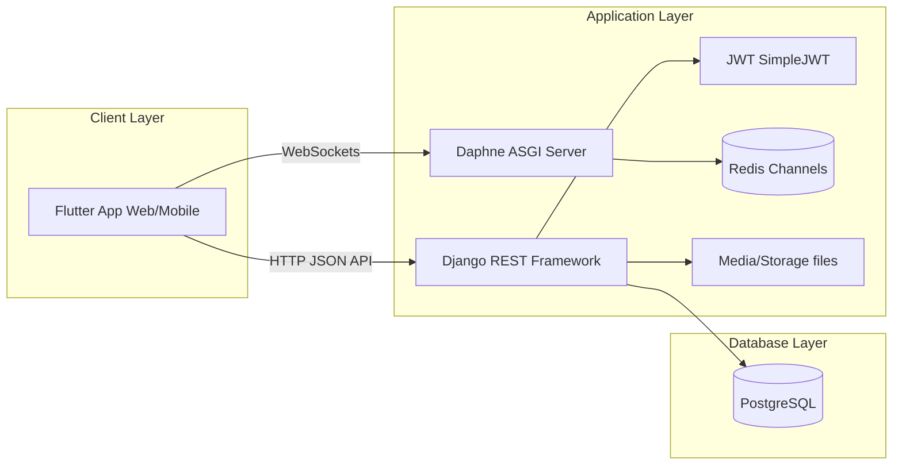

# DefenSYS — Capstone & Defense Management Platform

DefenSYS is an enterprise-grade, comprehensive platform built to streamline the orchestration and administration of academic capstones and project defenses. It bridges the communication and coordination gap between administrators, faculty advisors, panel members, and students by managing the entire lifecycle of defense stages, team rosters, scheduling, rubrics, grading, and document archiving.

---

## 🏗️ Architecture & Tech Stack



### Stack Components

*   **Backend Application:** [Django 6.x](https://docs.djangoproject.com/) & [Django REST Framework (DRF)](https://www.django-rest-framework.org/) for robust REST APIs.
*   **Realtime Features:** [Django Channels](https://channels.readthedocs.io/en/latest/) & [Daphne](https://github.com/django/daphne/) ASGI server with a [Redis](https://redis.io/) channel layer backing.
*   **Security & Authentication:** [SimpleJWT](https://django-rest-framework-simplejwt.readthedocs.io/en/latest/) for state-of-the-art token rotation, refresh, and role scoping.
*   **Frontend Client:** [Flutter 3.x](https://flutter.dev/) supporting both a responsive web administration console and cross-platform mobile app client flows, powered by [Riverpod](https://riverpod.dev/) for clean state management.
*   **Database:** PostgreSQL (production) / SQLite (isolated development).

---

## 📁 Repository Structure

```
├── backend/                       # Django REST API Backend
│   ├── defensys_backend/          # Main project configuration (settings, routes, asgi, urls)
│   ├── modules/                   # Monolithic modular apps (each in its own module folder)
│   │   ├── authentication_access_control/  # Custom User model, permissions, JWT & role scoping
│   │   ├── dashboards/            # Dashboard stats and analytics aggregator
│   │   ├── academic_period_management/     # Academic periods and semesters
│   │   ├── user_management/       # Roster management, student/faculty records, guest codes
│   │   ├── student_teams/         # Teams, members, adviser assignments, progress reports
│   │   ├── defense/               # Defense stages, scheduling system, panels, grading boards
│   │   ├── grading/               # Dynamic rubrics, peer evaluation, final grade tracking
│   │   └── repository/            # Digital vault, deliverables, audit trails
│   └── requirements.txt           # Main python dependency definitions
├── frontend/                      # Flutter Frontend Web & Mobile Codebase
│   ├── lib/
│   │   ├── config/                # Environment configurations (API hosts)
│   │   ├── screens/               # Screen widgets categorized by user role flow
│   │   ├── theme/                 # Global styling and local typography definitions
│   │   └── services/              # Riverpod providers, HTTP clients, storage bridges
│   └── pubspec.yaml               # Flutter package configurations
├── deployment/                    # Production configuration templates
│   ├── nginx/                     # Reverse proxy & WebSocket routing templates
│   └── systemd/                   # Daphne & Gunicorn systemd service configurations
├── docs/                          # Comprehensive user guides and runbooks
└── sample_file/                   # Demo importing templates for bulk rosters
```

---

## ⚙️ Quick Start & Local Setup

For a full step-by-step local validation, see the [Demo Setup Guide](file:///c:/Users/Admin/Desktop/DefenSYS/docs/DEMO_SETUP_GUIDE.md).

### 1. Backend Setup

Prerequisites: Python 3.10+, PostgreSQL, Redis server running locally.

1.  Navigate into the `backend/` directory:
    ```powershell
    cd backend
    ```
2.  Set up the virtual environment:
    *   Using the automatic Windows helper script:
        ```powershell
        powershell -ExecutionPolicy Bypass -File setup_venv.ps1
        .\venv\Scripts\Activate.ps1
        ```
    *   Or manually:
        ```powershell
        python -m venv venv
        .\venv\Scripts\Activate.ps1
        pip install -r requirements.txt
        ```
3.  Set up environment configurations:
    ```powershell
    copy .env.example .env
    ```
    *Open `.env` and fill in your database credentials, allowed hosts, and any other local overrides.*
4.  Run migrations and start local development:
    ```powershell
    python manage.py migrate
    python manage.py runserver 0.0.0.0:8000
    ```

### 2. Frontend Setup

Prerequisites: Flutter SDK 3.x installed.

1.  Navigate into the `frontend/` directory:
    ```powershell
    cd frontend
    ```
2.  Install dependencies:
    ```powershell
    flutter pub get
    ```
3.  Launch the client:
    *   **Flutter Web (Chrome):**
        ```powershell
        flutter run -d chrome
        ```
    *   **Android Emulator:**
        ```powershell
        flutter run --dart-define=DEFENSYS_ANDROID_EMULATOR=true
        ```
    *   **Physical Mobile Device (Wi-Fi):**
        ```powershell
        flutter run --dart-define=DEFENSYS_API_HOST=your-pc-lan-ip
        ```

---

## 🧪 Testing & Verification

Ensure you run tests locally before merging any changes to confirm code integrity.

### Backend Django Test Suite
```powershell
cd backend
python manage.py test authentication_access_control.test_security_regression authentication_access_control.tests academic_period_management.tests dashboards.tests user_management.tests student_teams.documents.tests defense.scheduler.tests --keepdb
```

### Frontend Flutter Test Suite
```powershell
cd frontend
flutter test
```

---

## 🚀 Deployment & Administration Guides

DefenSYS is prepared for staging and production hosting. Refer to the specific runbooks below for your environment:

*   **Pre-Launch Checklist:** Review security settings, token policies, and database connection limits at [DEPLOYMENT.md](file:///c:/Users/Admin/Desktop/DefenSYS/docs/DEPLOYMENT.md).
*   **Full Server Setup (Kamatera VPS):** Complete instructions for spinning up a Ubuntu VPS, building files, configuring Nginx, and linking Systemd services at [KAMATERA_DEPLOYMENT.md](file:///c:/Users/Admin/Desktop/DefenSYS/docs/KAMATERA_DEPLOYMENT.md).
*   **Disaster Recovery & Rebuilding:** Runbook to safely backup PostgreSQL and recreate environments from scratch at [KAMATERA_REBUILD_RUNBOOK.md](file:///c:/Users/Admin/Desktop/DefenSYS/docs/KAMATERA_REBUILD_RUNBOOK.md).
*   **Updates & Deploy Script Guide:** Instructions for rolling out updates without downtime at [UPDATE_GUIDE.md](file:///c:/Users/Admin/Desktop/DefenSYS/docs/UPDATE_GUIDE.md).

---

## 🤝 Git Workflow & Contributing

Please adhere to standard development flows. For details on branch names, pull requests, and commit guidelines, refer to the [Git Branching Guide](file:///c:/Users/Admin/Desktop/DefenSYS/docs/GIT_BRANCHING_GUIDE.md).
