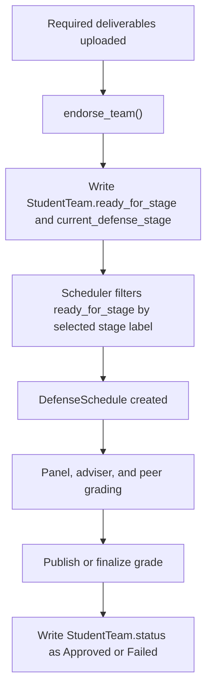
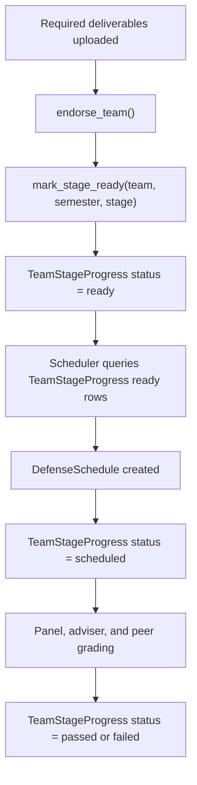

# DefenSYS Developer Improvement Audit

Date: 2026-05-27

This is a developer-facing audit of the risky logic areas I would improve first if I owned DefenSYS. It focuses on correctness, data safety, permission boundaries, and maintainability. It is not a full security penetration test, but it highlights the places where bugs are most likely to become serious.

## Executive Summary

DefenSYS is already structured around the right domain objects: semesters, teams, stages, schedules, rubrics, grade records, deliverables, and repository vault entries. The biggest remaining risk is that several workflows still infer important business context from labels, active-semester state, or "latest record" fallbacks. Those shortcuts are convenient, but dangerous in a multi-stage academic system because one wrong fallback can show, merge, publish, or archive the wrong team's record.

Highest priority improvements:

1. Make stage/event identity explicit everywhere, not label-based.
2. Make `TeamGrade` creation and schedule completion one authoritative service.
3. Reduce write side effects in GET endpoints.
4. Add hard permission scoping tests for every role-sensitive endpoint.
5. Make official completion, archive eligibility, and stage progression transactional.
6. Add operational safety checks before public/demo/production deployment.

## P0: Dangerous Logic To Fix First(fix)

### 1. Stage identity is still too label-based

Risk: Grades, rubrics, group settings, archive matching, and dashboards often use `stage_label` / `event_name` strings as identity. That makes renames, duplicate-looking labels, case differences, and old data risky.

Examples:

- `TeamGrade` uniqueness is currently `team + semester + scope + stage_label`.
- `DefenseSchedule.stage_label` returns either `event_name` or `defense_stage.label`.
- Grade settings lookup uses `DefenseStage.objects.filter(label=stage_label).first()`.
- Repository archive matching stores and compares `stage_label`.

Why this is dangerous:

- A stage rename can orphan old grade rows.
- Two stages with similar labels can be mixed by case-insensitive matching.
- A historical grade can be mistaken for the current stage if code falls back to "latest".
- PIT events and Capstone stages share the same broad `stage_label` concept even though they are different entities.

Recommended fix:

- Add explicit nullable foreign keys where possible:
  - `TeamGrade.defense_stage` for Capstone.
  - `TeamGrade.pit_event_config` or a first-class `PitEvent` model for PIT.
  - `VaultEntry.defense_stage` / `VaultEntry.pit_event_config` for archive provenance.
- Keep `stage_label` as a denormalized display snapshot only.
- Migrate existing rows by matching current labels once, then stop using labels as primary identity.
- Add tests for stage rename, duplicate case labels, and old-stage/current-stage dashboard visibility.

### 2. Grade rows are created and repaired from too many paths

Risk: `TeamGrade` can be created or altered from scheduler sync, grade center sync, panelist submission, guest submission, adviser submission, peer submission, and repository archive side effects.

Why this is dangerous:

- Each path can disagree about the canonical grade row.
- Race conditions can create duplicate attempts around the same schedule/stage.
- One fallback can accidentally mutate old grades.
- It becomes hard to reason about whether schedule, rubric, weights, peer state, and archive state are aligned.

Recommended fix:

- Create one service, for example `GradeContextService`, with methods like:
  - `get_or_create_for_schedule(schedule)`
  - `get_for_current_student_peer_context(team)`
  - `get_for_adviser_context(adviser, team, stage)`
  - `finalize_stage_group(semester, stage)`
- Make all views call that service instead of doing local `get_or_create`.
- Add a database constraint that covers the real identity:
  - Capstone: `team + semester + scope + defense_stage`
  - PIT: `team + semester + scope + pit_event_config`
- Keep legacy placeholder repair as an explicit management command, not a regular request-time cleanup.

### 3. GET endpoints still perform writes (fix)

Risk: `GradeCenterListView.get()` runs sync, peer summary refresh, and repair logic before returning data.

Why this is dangerous:

- Reading a page can modify grades, statuses, and timestamps.
- Debugging becomes confusing because "viewing" data changes data.
- Permission bugs become more dangerous because a read-scoped user might trigger writes.
- Production performance will become unpredictable as datasets grow.

Recommended fix:

- Move sync/repair jobs to explicit POST endpoints, Celery tasks, or scheduled maintenance commands.
- Make GET endpoints read-only.
- If automatic repair is needed, run it behind a staff-only command with audit logs.
- Add tests that GET grade center does not create/update grade rows.

### 4. Official completion and archive eligibility need a stronger transaction boundary (fix)

Risk: Marking an event/stage officially complete, auto-finalizing passed grades, setting schedule status, setting team status, and opening repository archive upload are connected but spread across services.

Why this is dangerous:

- A partial failure can leave a stage marked complete while grades are not finalized.
- A passed grade can become ready for archive without all downstream state being consistent.
- Repository upload can publish a grade after vault upload, which is a surprising side effect.

Recommended fix:

- Introduce a single `StageCompletionService`:
  - Lock affected grade rows with `select_for_update()`.
  - Validate panel/adviser/peer readiness.
  - Compute final grades.
  - Mark schedules done.
  - Mark grades ready for archive.
  - Update team stage gate.
  - Emit audit events.
- Only after this service succeeds should repository upload windows open.
- Add tests for rollback on failure.

### 5. Team progression is stored as loose status fields(fix)

Risk: `StudentTeam.status`, `ready_for_stage`, and `current_defense_stage` are strings representing a multi-stage workflow.

Why this is dangerous:

- One team-level `status` cannot represent multiple stage outcomes.
- Old stage pass/fail state can be overwritten by the current stage.
- A typo in a stage label can block scheduling or show wrong readiness.
- Progression history is hard to audit.

Current flow:



Recommended fix:

- Add `TeamStageProgress`:
  - `team`
  - `semester`
  - `defense_stage`
  - `status`: locked, ready, scheduled, grading, passed, failed, archived
  - `grade`
  - timestamps and actor fields
- Treat `StudentTeam.status` as a derived display summary or remove it from stage logic.
- Make scheduler use `TeamStageProgress.status == ready` instead of `ready_for_stage == label`.
- Keep legacy team fields as compatibility mirrors until the frontend no longer depends on them.
- For PIT, do not use `TeamStageProgress`; PIT is event-based and should use `TeamGrade.scope == pit` plus `pit_event_config` as the official repository upload gate.
- Keep `StudentTeam.status == Approved` as display context for PIT, but do not use it as proof that a specific PIT event passed.
- For PIT repository uploads, require an event-specific passing grade:
  - `TeamGrade.scope == pit`
  - `TeamGrade.pit_event_config` matches the completed event
  - `TeamGrade.status` is `ready_for_archive` or `published`
  - `TeamGrade.final_grade >= 75`
  - `VaultEntry.pit_event_config` links the uploaded PDF back to the event.

Suggested Capstone flow:



## P1: Important Improvements

### 6. Permission scoping should be centralized and regression-tested

Risk: Many endpoints use `IsAuthenticated` plus manual queryset scoping. That is fine only if every endpoint remembers to apply the right scope.

Examples to harden:

- Schedule list visibility for admin, PIT lead, panelist, adviser, student, uploader.
- Team adviser history currently fetches from the broad team queryset before returning history.
- Adviser and peer flows rely heavily on object filtering.
- Guest panelist routes use custom JWT principal claims and should remain schedule-bound.

Recommended fix:

- Create shared scope services:
  - `visible_teams_for(user)`
  - `manageable_teams_for(user)`
  - `visible_schedules_for(user)`
  - `grade_records_for(user)`
- Add matrix tests:
  - Admin can see all intended data.
  - PIT lead only sees their PIT year and not 3rd year capstone term.
  - Adviser only sees advised teams.
  - Student only sees their own team.
  - Panelist only sees assigned schedules.
  - Guest panelist only sees their token schedule.

### 7. Active semester switching needs operational guardrails

Risk: `Semester.save()` automatically deactivates other active semesters. This is correct structurally, but switching active term has huge effects across team creation, scheduling, dashboards, peer evaluation, and repository workflows.

Recommended fix:

- Add a confirmation endpoint for active-semester switching that returns impacted counts:
  - active teams
  - open schedules
  - pending grades
  - enabled peer/adviser windows
  - open deliverable windows
- Block switching if active grading windows or incomplete official-completion workflows exist unless admin uses a forced override.
- Write an `AcademicTermTransitionService` and log who changed it.

### 8. Schedule conflict detection should cover overlapping time ranges

Risk: Scheduler currently checks same room/date/start time, but overlapping slots with different start times can still collide.

Example:

- Existing schedule: 08:00-09:00
- New schedule: 08:30-09:30
- Same room, same date, different start time.

Recommended fix:

- Store or compute `end_time`.
- Validate overlapping intervals for the same room/date.
- Validate panelist double-booking across overlapping intervals.
- Add database indexes on `scheduled_date`, `room`, `start_time`, and possibly computed end time if supported.

### 9. Panelist grading submissions should validate rubric criteria more strictly

Risk: Panelist and guest submissions accept criterion names/scores from the client and create breakdown rows. They validate score ranges through model clean, but should also validate that submitted criteria match the assigned rubric.

Recommended fix:

- Require criterion IDs, not just names.
- Reject extra/missing criteria unless explicitly allowed.
- Store panelist identity in a real field instead of encoding it in `remarks`.
- Add `PanelistGradeSubmission` model:
  - `team_grade`
  - `schedule`
  - `panelist` or guest code
  - one row per panelist
  - breakdown children per criterion
- Recompute `panel_score` from those structured submissions.

### 10. Peer evaluation identity should avoid display-name matching

Risk: Peer evaluation submits `evaluateeName`, then matches by display name or username.

Why this is dangerous:

- Two students can have the same name.
- Display names can change.
- Frontend text drift can break submissions.

Recommended fix:

- Submit `evaluateeId`.
- Keep `evaluateeName` only for display.
- Add tests for duplicate names in one team.

### 11. Repository archive upload has surprising grade side effects

Risk: PIT and Capstone vault uploads can mark a grade as published after saving a vault entry.

Why this is dangerous:

- Uploading a PDF is not the same as approving/publishing academic results.
- A repository operation can silently change grading state.

Recommended fix:

- Split the flow:
  - Stage completion marks grade `ready_for_archive`.
  - Repository upload creates the vault entry.
  - Grade remains `ready_for_archive` unless an explicit publish action is taken.
- If publishing after archive is required by policy, show it as a named action and audit it.

## P2: Maintainability Improvements

### 12. Replace fallback rubric criteria in production paths

Risk: Some grade breakdown rebuild paths use fallback criteria when a rubric is missing.

Why this is dangerous:

- Missing rubric configuration can silently become a different rubric.
- Scores may look valid but be based on placeholder criteria.

Recommended fix:

- Allow fallback criteria only in tests/demo seeders.
- In production requests, return a clear configuration error.
- Add tests that missing stage rubric blocks grading and scheduling.

### 13. Add explicit audit logs for high-impact actions

High-impact actions to audit:

- Active semester changes.
- Stage/event official completion toggles.
- Grade publish/finalize/archive transitions.
- Manual grade edits after panel/adviser/peer submissions.
- Schedule delete/cancel/done.
- Team adviser changes.
- Repository vault uploads and replacements.
- Guest code creation/exchange/use.

Recommended fields:

- actor
- action
- target type/id
- old values
- new values
- reason
- request IP/user agent when available

### 14. Make destructive actions soft-delete or require reason fields

Risk areas:

- Deleting schedules.
- Deleting teams.
- Replacing vault files.
- Deleting deliverable templates.

Recommended fix:

- Prefer status transitions like cancelled/archived over hard delete.
- Require reason fields for destructive actions.
- Keep old records visible to admins in audit/history views.

### 15. Improve model-level constraints

Recommended constraints:

- One active schedule per team/stage/event, enforced at database level where possible.
- No overlapping room schedule.
- No overlapping panelist assignment.
- Grade record must match schedule scope/team/semester/stage.
- Capstone grade requires `defense_stage`; PIT grade requires `pit_event_config`.
- Team name uniqueness should include semester, not only name + level, if teams can recur across academic years.

## Security And Deployment Checks

Before making the repo public or deploying:

1. Confirm `.env`, `.env.local`, production env files, credentials, tokens, database dumps, and media uploads are untracked.
2. Confirm `DJANGO_DEBUG=False` in production.
3. Confirm `DJANGO_SECRET_KEY` is set and not committed.
4. Confirm `DJANGO_ALLOWED_HOSTS` is explicit.
5. Confirm CORS allows only the production frontend origins.
6. Confirm media file serving is behind proper authentication/authorization where files are not public.
7. Confirm JWT refresh token blacklist is enabled and migrations are applied.
8. Confirm guest panelist JWT lifetime is short and schedule-bound.
9. Confirm sample PDFs contain no real student/private data.
10. Run the critical backend suites before release.

Suggested release test command:

```bash
python manage.py test authentication_access_control.test_security_regression authentication_access_control.tests academic_period_management.tests user_management.tests student_teams.tests student_teams.tests_term_scope defense.scheduler.tests defense.board.tests defense.stages.tests grading.grades.tests grading.rubrics.tests repository.audit.tests repository.deliverables.tests repository.vault.tests dashboards.tests --keepdb
```

## Suggested Implementation Roadmap

### Phase 1: Stabilize identity and reads

- Add stage/event foreign keys to `TeamGrade`.
- Migrate existing grade rows.
- Update dashboard, adviser, peer, scheduler, and repository code to use IDs.
- Remove "latest grade" fallbacks from student-facing views.
- Stop GET grade center from writing data.

### Phase 2: Centralize grade/schedule services

- Create `GradeContextService`.
- Create `StageCompletionService`.
- Move all `TeamGrade.objects.get_or_create(...)` calls into the service.
- Add row locking and transaction tests around completion.

### Phase 3: Harden permissions

- Build shared scope services.
- Add role matrix tests.
- Audit every `IsAuthenticated` endpoint for object-level filtering.

### Phase 4: Improve workflow history

- Add `TeamStageProgress`.
- Convert team status/stage strings into derived display fields.
- Add audit logs for stage and grade transitions.

### Phase 5: Operational polish

- Add active-semester switch impact preview.
- Add schedule overlap checks.
- Add public-repo safety checklist to CI or a local script.
- Add release smoke tests for the main flows.

## Final Developer Opinion

The system is close to being reliable, but it needs fewer implicit fallbacks. Academic workflows are history-heavy: every semester, stage, rubric, and grade record must remain true after the next semester starts. The safest direction is to make identity explicit, make reads read-only, and put every high-impact workflow behind one authoritative service with transaction boundaries and tests.

