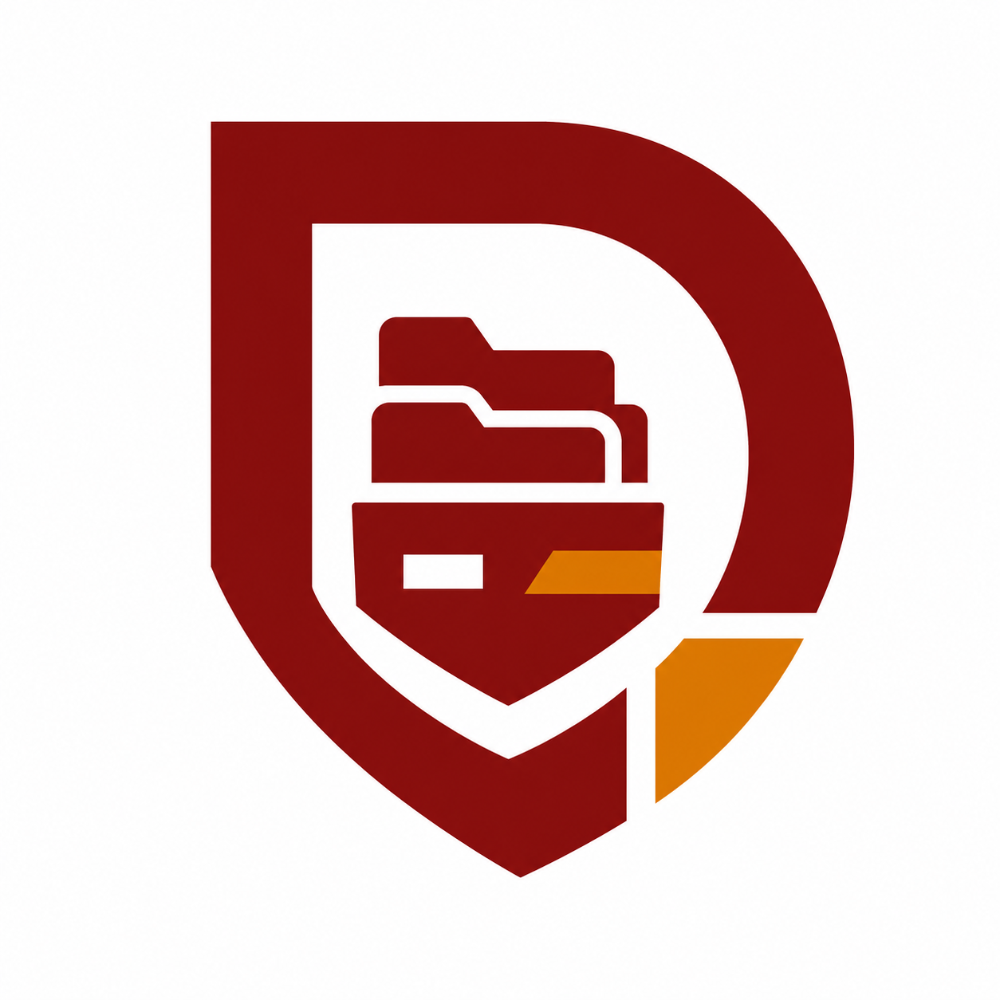

# DefenSYS Official Logo

## Official Direction

The official DefenSYS logo is the **D-shaped repository shield**.

It keeps the system identity simple: a bold `D` silhouette for **DefenSYS**, a shield form for **defense and protection**, and a repository/folder symbol for **submitted files, academic records, review artifacts, and defense documentation**.

## Core Idea

**Name:** DefenSYS Repository Shield

**Symbol:** A maroon `D`-shaped shield containing a protected repository stack. A gold accent marks the selected or approved repository item.

**Personality:** Minimal, official, academic, and system-driven. It should feel like a trusted defense management platform, not a generic cybersecurity badge.

## Why This Is The Official Mark

- The `D` silhouette makes the logo specific to **DefenSYS**.
- The shield connects to academic defense without looking aggressive.
- The repository/folder detail represents submissions, rubrics, reports, records, and archived defense documents.
- The gold accent gives the mark a recognizable highlight using the existing DefenSYS theme.
- The icon works without text, which makes it stronger for app icons, favicons, compact navigation, and launcher branding.

## Official Asset

| Asset | Path | Use |
|-------|------|-----|
| Official logo | `frontend/assets/logo.png` | App icon source, login logo, reports, dashboard branding |
| Legacy logo backup | `frontend/assets/logo-legacy.png` | Previous logo retained for reference only |

The app already references `assets/logo.png`, so replacing this file makes the new mark the system logo without changing Flutter screen code.

## Color Palette

| Token | Hex | Use |
|-------|-----|-----|
| `DefensysTokens.maroon` | `#7A110A` | Main D-shield shape |
| `DefensysTokens.gold` | `#D97706` | Repository approval accent |
| `DefensysTokens.surface` | `#FFFFFF` | Negative space and background |
| `DefensysTokens.background` | `#F3F4F6` | Preview background only |
| `DefensysTokens.textPrimary` | `#111827` | Optional text when a full wordmark is needed |

## Recommended Lockups

### Primary App Mark

Use the icon only.

Best for:

- App launcher icon
- Browser favicon
- Sidebar compact logo
- Splash screen symbol
- Small dashboard branding

### Full Brand Lockup

Use the icon with `DefenSYS` text only when the available space is large enough.

Best for:

- Login screen
- Documentation covers
- Reports
- Presentation slides
- Email templates

## Usage Rules

- Prefer the icon-only mark for small sizes.
- Do not add people icons inside the shield.
- Do not add a checkmark; the repository accent already communicates approval.
- Do not add padlocks, circuit boards, or cybersecurity imagery.
- Do not use bright yellow; use `#D97706` for gold.
- Keep enough padding around the mark so the lower gold accent does not touch container edges.
- Use the wordmark only when it improves recognition; for app icons, remove the text.

## AI Image Prompt

Create an icon-only official logo for DefenSYS. Use a bold maroon `D`-shaped shield with a protected repository/folder stack inside it. Add a small gold accent on one repository layer to suggest a selected or approved submission. Use flat vector-style shapes, crisp edges, white negative space, and no text. Primary color `#7A110A`, accent color `#D97706`, background `#FFFFFF`. The mark should be readable as an app icon and favicon. Avoid people icons, checkmarks, padlocks, circuit boards, gradients, shadows, taglines, and extra text.
