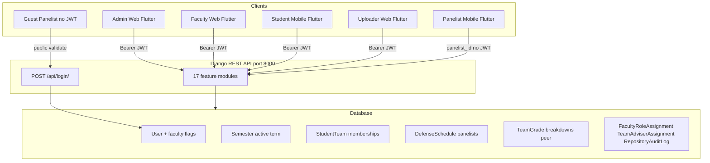
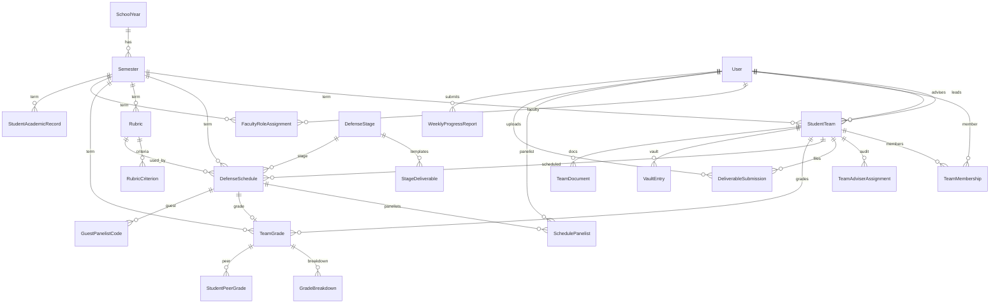
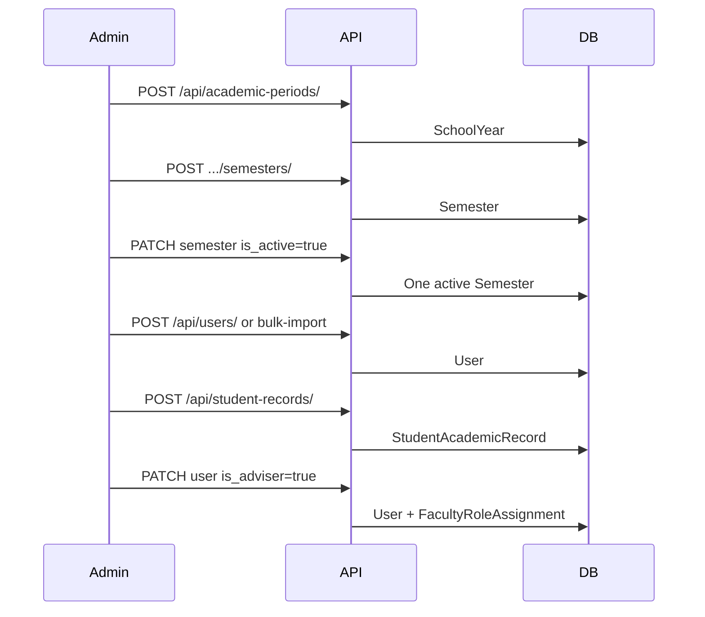
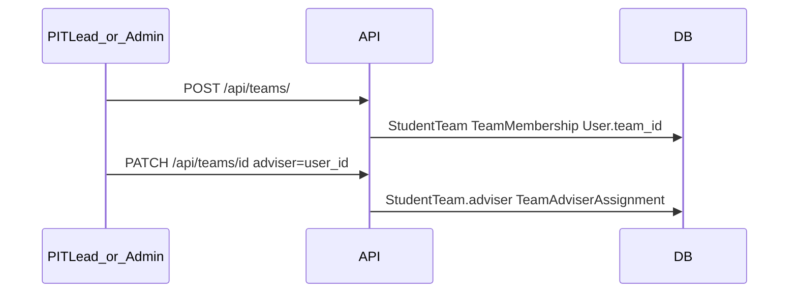
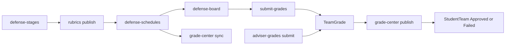

# DefenSYS Real System Flow Audit (Code-Derived)

**Generated from:** Django `urls.py` / `views.py` / `models.py` and Flutter `lib/services/` + `lib/screens/`  
**Not from:** `docs/DEFENSYS_FLOW_OVERVIEW.md` or other product docs  
**Purpose:** Validate whether the implemented API, data model, and UI wiring match your intended capstone workflow.

**Base URL:** `http://<host>:8000/api/` (Flutter: `ApiConfig.baseUrl`)

---

## Table of contents

1. [System architecture](#1-system-architecture)
2. [Roles and capabilities](#2-roles-and-capabilities)
3. [Entity relationship model](#3-entity-relationship-model)
4. [Complete API catalog](#4-complete-api-catalog)
5. [Data persistence reference](#5-data-persistence-reference)
6. [End-to-end flows](#6-end-to-end-flows)
7. [Frontend screen → API appendix](#7-frontend-screen--api-appendix)
8. [Gap checklist and prioritized fixes](#8-gap-checklist-and-prioritized-fixes)
9. [How to validate your workflow](#9-how-to-validate-your-workflow)

---

## 1. System architecture

### Authentication

| Step | Detail |
|------|--------|
| Login | `POST /api/login/` → JWT `access` (7 days) + `refresh` (30 days) + embedded `user` object |
| Storage | Flutter `SharedPreferences`: `jwt_token`, `user_data` |
| API calls | `Authorization: Bearer <access>` on almost all endpoints |
| Refresh | `POST /api/token/refresh/` exists; **Flutter does not use it** |
| Custom user | `AUTH_USER_MODEL = authentication_access_control.User` |

### Installed backend apps (17 modules)

`authentication_access_control`, `dashboards`, `academic_period_management`, `user_management` (includes `academic_records`), `student_teams` (includes `documents`, `weekly_progress`), `defense` (stages, scheduler, board), `grading` (rubrics, grades), `repository` (vault, deliverables, audit), `curriculum_analytics`

Root routing: [`backend/defensys_backend/urls.py`](../backend/defensys_backend/urls.py)

---

## 2. Roles and capabilities

### 2.1 Base role (`User.role`)

| Value | Typical UI | Login platform gate (Flutter) |
|-------|------------|-------------------------------|
| `admin` | Admin web shell | Web only (`login_screen.dart`) |
| `faculty` | Faculty web + mobile panelist | Web + mobile |
| `student` | Student mobile app | Mobile only |

### 2.2 Faculty capability flags (combinable)

| Flag | Meaning | Primary write APIs |
|------|---------|-------------------|
| `is_pit_lead` + `pit_lead_year` | PIT lead for a year level | teams, defense-schedules, defense-board, grade-center, rubrics |
| `is_adviser` | Project adviser capability | capstone-deliverables, weekly-progress (read), adviser-grades |
| `is_panelist` | Defense panelist | panelist-assignments, submit-grades (mobile) |
| `is_repo_assistant` | Repository assistant | repository-audit upload/classify |
| `is_uploader` | Document uploader | teams GET, documents upload |

**Display role priority** (admin UI badge): admin → PIT lead → adviser → panelist → repo assistant (`user_management/role_assignments.py`).

### 2.3 Two separate “adviser” concepts

| Concept | Where set | Audit table | Purpose |
|---------|-----------|-------------|---------|
| **Adviser capability** | User Management → Access Control (`is_adviser`) | `FacultyRoleAssignment` | Faculty may advise this term |
| **Team adviser** | Student Teams (`StudentTeam.adviser`) | `TeamAdviserAssignment` | Which faculty advises which team |

Toggling `is_adviser` does **not** assign a team adviser automatically.

### 2.4 External / synthetic identities

| Identity | Mechanism |
|----------|-----------|
| Guest panelist | `GuestPanelistCode` + `GET /api/users/guest-codes/validate/<code>/` (no JWT) |
| Mobile panelist grading | `panelist_id` in query/body on defense-scheduler endpoints (no JWT) |

### 2.5 Permission classes (backend)

| Class | Who passes |
|-------|------------|
| `IsAuthenticated` | Any valid JWT |
| `IsSystemAdmin` | `role == admin` or `is_superuser` |
| `CanManageTeams` | admin, PIT lead; uploader **GET only** |
| `CanManageSchedules` | admin, PIT lead |
| `CanManageBoard` | admin, PIT lead |
| `CanManageGradeCenter` | admin, PIT lead |
| `CanManageRubrics` | admin, PIT lead |
| `CanManageDeliverables` | admin, faculty+adviser, student (scoped) |

Many endpoints add **queryset scoping** in services even when only `IsAuthenticated` is required.

---

## 3. Entity relationship model

**Hub tables:** `User`, `Semester` (one `is_active` at a time), `StudentTeam`, `DefenseSchedule`, `TeamGrade`.

**Modules with no own models:** `defense_board` (uses `DefenseSchedule`), `dashboards` (aggregates), `curriculum_analytics` (read-only).

---

## 4. Complete API catalog

**Summary:** ~78 URL patterns, ~94 HTTP operations. All paths below are under `/api/`.

**Legend — Permissions column:**
- `Public` — no JWT
- `JWT` — `IsAuthenticated`
- `Admin` — `IsSystemAdmin`
- `PIT` — admin or `is_pit_lead`
- `Scoped` — JWT + queryset rules in service/view

**Legend — Removed:** demo-fill / seed-demo prototype endpoints are no longer available.

---

### 4.1 Authentication (`authentication_access_control`)

| Method | Path | Permission | DB writes |
|--------|------|------------|-----------|
| POST | `/api/login/` | Public | Read `User` only |
| POST | `/api/token/refresh/` | Public | New access token |

**Flutter:** `auth_provider.dart` → `login_screen.dart`

---

### 4.2 Dashboards (`dashboards`)

| Method | Path | Permission | DB writes |
|--------|------|------------|-----------|
| GET | `/api/dashboards/admin/` | JWT | None (aggregates) |
| GET | `/api/dashboards/faculty/` | JWT | None |
| GET | `/api/dashboards/student/` | JWT | None |
| GET | `/api/dashboards/panelist/` | JWT | None |

**Note:** No role check on URL; any authenticated user can call any dashboard endpoint.

**Flutter:** `dashboard_provider.dart`

---

### 4.3 Academic periods (`academic_period_management`)

| Method | Path | Permission | DB writes |
|--------|------|------------|-----------|
| GET | `/api/academic-periods/` | JWT | Read `SchoolYear`, `Semester` |
| POST | `/api/academic-periods/` | JWT | `SchoolYear` |
| POST | `/api/academic-periods/<school_year_id>/semesters/` | JWT | `Semester` |
| PATCH | `/api/academic-periods/semesters/<semester_id>/` | JWT | Active semester; deactivates others |

**Side effect:** `Semester.save()` with `is_active=True` bulk-updates all other semesters to inactive.

**Flutter:** `academic_period_provider.dart` → `academic_periods_screen.dart`, `admin_shell.dart`

---

### 4.4 User management (`user_management`)

| Method | Path | Permission | DB writes |
|--------|------|------------|-----------|
| GET | `/api/users/` | Admin | Read `User` |
| POST | `/api/users/` | Admin | `User` |
| GET | `/api/users/<user_id>/` | Admin | Read |
| PATCH | `/api/users/<user_id>/` | Admin | `User`; on flag change → `FacultyRoleAssignment` + `ensure_active_role_history()` |
| DELETE | `/api/users/<user_id>/` | Admin | Delete `User` (not self) |
| POST | `/api/users/bulk-import/` | Admin | `User` + optional `StudentAcademicRecord` |
| GET | `/api/users/guest-codes/` | Admin | Read `GuestPanelistCode` |
| POST | `/api/users/guest-codes/` | Admin | `GuestPanelistCode` (auto `code`) |
| PATCH | `/api/users/guest-codes/<code_id>/` | Admin | Activate/deactivate code |
| GET | `/api/users/guest-codes/validate/<code>/` | **Public** | Read only |
| GET | `/api/users/<user_id>/role-assignments/` | Admin | Read `FacultyRoleAssignment` |
| GET | `/api/users/<user_id>/adviser-assignments/` | Admin | Read `TeamAdviserAssignment` (by faculty) |

**Flutter:** `user_management_provider.dart` → `user_management_screen.dart`

---

### 4.5 Student academic records (`student_academic_records`)

| Method | Path | Permission | DB writes |
|--------|------|------------|-----------|
| GET | `/api/student-records/` | Admin | Read |
| POST | `/api/student-records/` | Admin | `StudentAcademicRecord` |
| PATCH | `/api/student-records/<record_id>/` | Admin | Update record |
| DELETE | `/api/student-records/<record_id>/` | Admin | Delete record |
| GET | `/api/student-records/rollover-preview/` | Admin | Read (computed) |
| POST | `/api/student-records/rollover/` | Admin | New records + capstone team phase advance |

**Flutter:** `student_academic_records_provider.dart` → `student_academic_records_screen.dart`

---

### 4.6 Student teams (`student_teams`)

| Method | Path | Permission | DB writes |
|--------|------|------------|-----------|
| GET | `/api/teams/` | Scoped JWT | Read teams visible to user |
| POST | `/api/teams/` | PIT (`CanManageTeams`) | `StudentTeam`, `TeamMembership`, `User.team_id` |
| GET | `/api/teams/<team_id>/` | Scoped | Read detail + options |
| PATCH | `/api/teams/<team_id>/` | PIT | Team + memberships; adviser change → `TeamAdviserAssignment` |
| DELETE | `/api/teams/<team_id>/` | PIT | Delete team; clear member `team_id` |
| POST | `/api/teams/bulk-import/` | PIT | Batch teams |
| GET | `/api/teams/<team_id>/adviser-history/` | Scoped | Read `TeamAdviserAssignment` |

**Team visibility (`teams_queryset_for_user`):** admin → all; PIT/uploader → all; faculty → advised teams; student → member/leader teams.

**Flutter:** `student_teams_provider.dart` → `student_teams_screen.dart`, `uploader_dashboard.dart` (GET)

---

### 4.7 Defense stages (`defense_stages`)

| Method | Path | Permission | DB writes |
|--------|------|------------|-----------|
| GET | `/api/defense/stages/` | JWT | Read `DefenseStage`, `StageDeliverable` |
| POST | `/api/defense/stages/` | Admin | `DefenseStage` |
| PATCH | `/api/defense/stages/<stage_id>/` | Admin | Update stage |
| DELETE | `/api/defense/stages/<stage_id>/` | Admin | Delete stage |
| POST | `/api/defense/stages/<stage_id>/deliverables/` | Admin | `StageDeliverable` |
| PATCH | `/api/defense/stages/<stage_id>/deliverables/<deliverable_id>/` | Admin | Update template |
| DELETE | `/api/defense/stages/<stage_id>/deliverables/<deliverable_id>/` | Admin | Delete template |

**Flutter:** `defense_stages_provider.dart` → `defense_stages_screen.dart`

---

### 4.8 Rubric engine (`rubric_engine`)

| Method | Path | Permission | DB writes |
|--------|------|------------|-----------|
| GET | `/api/rubrics/` | JWT (drafts hidden for non-managers) | Read |
| POST | `/api/rubrics/` | PIT | `Rubric`, `RubricCriterion` |
| PATCH | `/api/rubrics/<rubric_id>/` | PIT | Update + sync criteria |
| DELETE | `/api/rubrics/<rubric_id>/` | PIT | Delete |
| POST | `/api/rubrics/<rubric_id>/publish/` | PIT | `is_locked=True` |
| PATCH | `/api/rubrics/<rubric_id>/weights/` | PIT | panel/adviser/peer weights |
| POST | `/api/rubrics/seed-demo/` | PIT | **Prototype** demo rubrics |

**Flutter:** `rubric_engine_provider.dart`, `adviser_grading_provider.dart` → `rubric_engine_screen.dart`, `adviser_grading_screen.dart`

---

### 4.9 Defense scheduler (`defense_scheduler`)

| Method | Path | Permission | DB writes |
|--------|------|------------|-----------|
| GET | `/api/defense/schedules/` | Scoped JWT | Read schedules |
| POST | `/api/defense/schedules/` | PIT | `DefenseSchedule`, `SchedulePanelist` |
| POST | `/api/defense/schedules/generate-plan/` | PIT | Preview only |
| POST | `/api/defense/schedules/confirm-plan/` | PIT | Batch schedules + panelists |
| PATCH | `/api/defense/schedules/<schedule_id>/` | PIT | Update schedule |
| DELETE | `/api/defense/schedules/<schedule_id>/` | PIT | Delete schedule |
| GET | `/api/defense/schedules/panelist-assignments/?panelist_id=` | **Public** | Read schedules/teams/rubrics |
| POST | `/api/defense/schedules/submit-grades/` | **Public** | `TeamGrade`, `GradeBreakdown`, `panel_score` |

**Gap:** Schedule create does **not** create `TeamGrade`; grade-center sync required.

**Flutter:** `defense_scheduler_provider.dart`; mobile direct HTTP → `panelist_dashboard.dart`, `grade_sheet_tab.dart`

---

### 4.10 Defense board (`defense_board`)

| Method | Path | Permission | DB writes |
|--------|------|------------|-----------|
| GET | `/api/defense/board/` | Scoped JWT | Read `DefenseSchedule` (PIT year filter) |
| PATCH | `/api/defense/board/<schedule_id>/` | PIT | `DefenseSchedule.status` |
| DELETE | `/api/defense/board/<schedule_id>/` | PIT | Delete schedule |

**Flutter:** `defense_board_provider.dart` → `defense_board_screen.dart`

---

### 4.11 Grade center (`grade_center`)

| Method | Path | Permission | DB writes |
|--------|------|------------|-----------|
| GET | `/api/grade-center/` | Scoped JWT | Read; auto-runs `sync_missing_grade_rows()` |
| POST | `/api/grade-center/sync/` | PIT | Create/update `TeamGrade` from schedules/teams |
| PATCH | `/api/grade-center/<grade_id>/` | PIT | panel/adviser/peer scores |
| POST | `/api/grade-center/<grade_id>/publish/` | PIT | Publish; may set schedule `done`, team Approved/Failed |
| PATCH | `/api/grade-center/evaluation-settings/` | Admin | `Semester.capstone_peer_evaluation_enabled`, `capstone_adviser_grading_enabled` |
| GET | `/api/grade-center/adviser-grades/` | JWT (adviser scoped) | Read advised team grades |
| POST | `/api/grade-center/adviser-grades/<grade_id>/submit/` | JWT (adviser) | `adviser_score`, `GradeBreakdown` |
| POST | `/api/grade-center/demo-fill/` | PIT | **Prototype** fill + publish demo grades |

**No student peer-submit endpoint exists** — see Gap #1.

**Flutter:** `grade_center_provider.dart`, `adviser_grading_provider.dart` → `grade_center_screen.dart`, `adviser_grading_screen.dart`

---

### 4.12 Capstone deliverables (`capstone_deliverables`)

| Method | Path | Permission | DB writes |
|--------|------|------------|-----------|
| GET | `/api/capstone-deliverables/` | Scoped JWT | Read submission status per team/stage |
| POST | `/api/capstone-deliverables/upload/` | `CanManageDeliverables` | `DeliverableSubmission` (+ PDF extract on save) |
| POST | `/api/capstone-deliverables/remove/` | `CanManageDeliverables` | Remove submission |
| POST | `/api/capstone-deliverables/endorse/` | `CanManageDeliverables` | `StudentTeam.ready_for_stage`, `current_defense_stage` |
| POST | `/api/capstone-deliverables/compile-weekly-reports/` | `CanManageDeliverables` | PDF generation (no new model) |
| POST | `/api/capstone-deliverables/demo-fill/` | `CanManageDeliverables` | **Prototype** |

**Flutter:** `capstone_deliverables_provider.dart` + direct multipart in `capstone_deliverables_screen.dart`

---

### 4.13 Digital vault (`digital_vault`)

| Method | Path | Permission | DB writes |
|--------|------|------------|-----------|
| GET | `/api/digital-vault/` | JWT | Read `VaultEntry` (filtered by role) |

**Flutter:** `digital_vault_provider.dart` → `digital_vault_screen.dart`, `repository_tab.dart`

---

### 4.14 Repository audit (`repository_audit`)

| Method | Path | Permission | DB writes |
|--------|------|------------|-----------|
| GET | `/api/repository-audit/` | JWT + `repository_scope()` | Read entries |
| POST | `/api/repository-audit/upload-pit/` | Scoped | `VaultEntry`, `RepositoryAuditLog` |
| POST | `/api/repository-audit/classify/` | Scoped | Vault metadata + log |
| POST | `/api/repository-audit/override-status/` | Admin only in scope | Vault + log |
| GET | `/api/repository-audit/export/` | Scoped | CSV download |
| POST | `/api/repository-audit/demo-fill/` | Admin | **Prototype** |

**Scope:** admin → full; PIT lead → year-scoped PIT; repo assistant → PIT upload/classify; others → 403.

**Flutter:** `repository_audit_provider.dart` → `repository_audit_screen.dart`

---

### 4.15 Curriculum analytics (`curriculum_analytics`)

| Method | Path | Permission | DB writes |
|--------|------|------------|-----------|
| GET | `/api/curriculum-analytics/` | JWT → **admin in service** | Read-only aggregate |
| POST | `/api/curriculum-analytics/proposal/` | JWT → admin in service | Generated text only |

**Flutter:** `curriculum_analytics_provider.dart` → `curriculum_analytics_screen.dart`

---

### 4.16 Weekly progress (`student_weekly_progress`)

| Method | Path | Permission | DB writes |
|--------|------|------------|-----------|
| GET | `/api/weekly-progress/` | Scoped JWT | Student own / adviser teams / admin all |
| POST | `/api/weekly-progress/` | JWT (team leaders) | `WeeklyProgressReport` |
| GET | `/api/weekly-progress/<pk>/` | Scoped | Read |
| PUT | `/api/weekly-progress/<pk>/` | Team leader | Update |
| DELETE | `/api/weekly-progress/<pk>/` | Team leader | Delete |
| GET | `/api/weekly-progress/<pk>/file/` | Scoped | File download (`?token=` supported) |

**Flutter:** `weekly_progress_provider.dart` + direct POST in `weekly_report_tab.dart`

---

### 4.17 Team documents (`team_documents`)

| Method | Path | Permission | DB writes |
|--------|------|------------|-----------|
| GET | `/api/documents/` | Scoped JWT | Read `TeamDocument` |
| POST | `/api/documents/upload/` | JWT | `TeamDocument` (team must exist; **no membership check**) |
| GET | `/api/documents/<document_id>/` | Scoped | Metadata |
| DELETE | `/api/documents/<document_id>/` | Scoped | Delete |
| GET | `/api/documents/<document_id>/download/` | Scoped | File stream |

**Flutter:** direct HTTP in `uploader_dashboard.dart`, `repository_tab.dart`

---

### 4.18 Non-API routes

| Path | Notes |
|------|-------|
| `/admin/` | Django admin |
| `/media/<path>` | Uploaded files when `DEBUG=True` |

---

## 5. Data persistence reference

**No Django signals** in `backend/modules/`. Writes happen in serializers, views, services, and model `save()`.

### 5.1 Major user actions → tables

| User action | API | Tables written |
|-------------|-----|----------------|
| Login | POST `/api/login/` | None |
| Create user | POST `/api/users/` | `User` |
| Toggle faculty role | PATCH `/api/users/<id>/` | `User`, `FacultyRoleAssignment` |
| Bulk import users | POST `/api/users/bulk-import/` | `User`, optional `StudentAcademicRecord` |
| Set active semester | PATCH academic-periods semester | `Semester` (one active) |
| Create team | POST `/api/teams/` | `StudentTeam`, `TeamMembership`, `User.team_id` |
| Change team adviser | PATCH `/api/teams/<id>/` | `StudentTeam`, `TeamAdviserAssignment` |
| Upload capstone file | POST capstone-deliverables/upload | `DeliverableSubmission` |
| Endorse for defense | POST capstone-deliverables/endorse | `StudentTeam` flags |
| Create schedule | POST defense-schedules | `DefenseSchedule`, `SchedulePanelist` |
| Panelist submit grades | POST submit-grades | `TeamGrade`, `GradeBreakdown` |
| Sync grades | GET grade-center or POST sync | `TeamGrade` |
| Adviser submit grade | POST adviser-grades/.../submit | `TeamGrade`, `GradeBreakdown` |
| Publish grade | POST grade-center/.../publish | `TeamGrade`, maybe `DefenseSchedule`, `StudentTeam.status` |
| Semester rollover | POST student-records/rollover | `StudentAcademicRecord`, capstone team updates |
| PIT vault upload | POST repository-audit/upload-pit | `VaultEntry`, `RepositoryAuditLog` |

### 5.2 Model `save()` side effects

| Model | Side effect |
|-------|-------------|
| `Semester` | Deactivates other active semesters |
| `DefenseSchedule` | PIT/capstone field normalization; validation |
| `Rubric` | Lock on publish; PIT clears stage/adviser weight |
| `TeamGrade` | `recalculate()` final grade before persist |
| `DeliverableSubmission`, `VaultEntry`, `WeeklyProgressReport` | PDF text extraction when file attached |
| `GuestPanelistCode` | Auto-generate unique `code` |

---

## 6. End-to-end flows

### 6.1 Term setup (admin)

**Screens:** `academic_periods_screen.dart`, `user_management_screen.dart`, `student_academic_records_screen.dart`

---

### 6.2 Teams and adviser assignment

**Prerequisite:** Faculty should have `is_adviser` capability (User Management) before or after team assignment — these are independent.

**Screen:** `student_teams_screen.dart`

---

### 6.3 Capstone work (deliverables + weekly reports)

| Step | Actor | API | Tables |
|------|-------|-----|--------|
| Upload deliverable | Student / adviser | POST `/api/capstone-deliverables/upload/` | `DeliverableSubmission` |
| Endorse ready | Adviser | POST `/api/capstone-deliverables/endorse/` | `StudentTeam` stage flags |
| Weekly report | Team leader (student) | POST `/api/weekly-progress/` | `WeeklyProgressReport` |
| Compile reports PDF | Adviser | POST `/api/capstone-deliverables/compile-weekly-reports/` | Generated file |

**Screens:** `capstone_deliverables_screen.dart`, `weekly_progress_reports_screen.dart`, `weekly_report_tab.dart`

---

### 6.4 Defense and grading pipeline

| Step | API | Tables |
|------|-----|--------|
| Define stages | `/api/defense/stages/` | `DefenseStage`, `StageDeliverable` |
| Publish rubric | POST `/api/rubrics/<id>/publish/` | `Rubric` locked |
| Schedule defense | POST `/api/defense/schedules/` | `DefenseSchedule`, `SchedulePanelist` |
| Board status | PATCH `/api/defense/board/<id>/` | `DefenseSchedule.status` |
| Ensure grade rows | GET `/api/grade-center/` or POST `sync/` | `TeamGrade` |
| Panelist scores | POST `submit-grades/` | `GradeBreakdown`, `panel_score` |
| Adviser scores | POST `adviser-grades/<id>/submit/` | `adviser_score`, breakdown |
| Publish final | POST `/<grade_id>/publish/` | Published grade + team outcome |

---

### 6.5 Repository / PIT vault

| Step | API | Tables |
|------|-----|--------|
| Upload PIT | POST `/api/repository-audit/upload-pit/` | `VaultEntry`, `RepositoryAuditLog` |
| Classify | POST `classify/` | Vault + log |
| Override (admin) | POST `override-status/` | Vault + log |
| Analytics view | GET `/api/curriculum-analytics/` | Read-only |

---

### 6.6 End-of-term rollover

| Step | API | Tables |
|------|-----|--------|
| Preview | GET `/api/student-records/rollover-preview/` | Computed |
| Execute | POST `/api/student-records/rollover/` | New `StudentAcademicRecord`, team phase advance |

**Screen:** `student_academic_records_screen.dart` + `student_records_rollover_modal.dart`

---

## 7. Frontend screen → API appendix

### 7.1 Providers (`frontend/lib/services/`)

| Provider | Base path | Backend module |
|----------|-----------|----------------|
| `auth_provider` | `/api/login/` | authentication_access_control |
| `academic_period_provider` | `/api/academic-periods/` | academic_period_management |
| `user_management_provider` | `/api/users/` | user_management |
| `student_teams_provider` | `/api/teams/` | student_teams |
| `student_academic_records_provider` | `/api/student-records/` | student_academic_records |
| `defense_stages_provider` | `/api/defense/stages/` | defense_stages |
| `rubric_engine_provider` | `/api/rubrics/` | rubric_engine |
| `defense_scheduler_provider` | `/api/defense/schedules/` | defense_scheduler |
| `defense_board_provider` | `/api/defense/board/` | defense_board |
| `grade_center_provider` | `/api/grade-center/` | grade_center |
| `adviser_grading_provider` | grade-center + rubrics | grade_center, rubric_engine |
| `capstone_deliverables_provider` | `/api/capstone-deliverables/` | capstone_deliverables |
| `digital_vault_provider` | `/api/digital-vault/` | digital_vault |
| `repository_audit_provider` | `/api/repository-audit/` | repository_audit |
| `curriculum_analytics_provider` | `/api/curriculum-analytics/` | curriculum_analytics |
| `dashboard_provider` | `/api/dashboards/{role}/` | dashboards |
| `weekly_progress_provider` | `/api/weekly-progress/` | student_weekly_progress |
| `bridge_service` | guest validate (Django); rest **mock** | mixed |

### 7.2 Admin web (`AdminShell`)

| Screen | Provider / HTTP | Endpoints used |
|--------|-----------------|----------------|
| `admin_shell.dart` | dashboard, academicPeriod, auth | GET dashboards/admin, GET academic-periods |
| `admin_dashboard_content.dart` | dashboard | GET dashboards/admin |
| `academic_periods_screen.dart` | academicPeriod | academic-periods CRUD |
| `user_management_screen.dart` | userManagement, academicPeriod | users CRUD, role-assignments, bulk-import, guest-codes |
| `student_teams_screen.dart` | studentTeams, dashboard faculty | teams CRUD, adviser-history |
| `student_academic_records_screen.dart` | studentAcademicRecords | student-records CRUD, rollover |
| `grade_center_screen.dart` | gradeCenter | grade-center list/patch/publish, evaluation-settings |
| `rubric_engine_screen.dart` | rubricEngine | rubrics CRUD, publish, weights |
| `rubric_full_page_editor.dart` | rubricEngine | rubrics PATCH |
| `repository_audit_screen.dart` | repositoryAudit | repository-audit all actions |
| `curriculum_analytics_screen.dart` | curriculumAnalytics | analytics GET, proposal POST |
| `defense_scheduler_screen.dart` | defenseScheduler | schedules list, generate/confirm plan |
| `defense_board_screen.dart` | defenseBoard | defense-board GET/PATCH/DELETE |
| `defense_stages_screen.dart` | defenseStages | defense-stages CRUD + deliverables |
| `adviser_criteria_screen.dart` | inline provider | rubrics (orphan — not in nav) |

### 7.3 Faculty web

| Screen | Provider / HTTP | Endpoints |
|--------|-----------------|-----------|
| `faculty_dashboard.dart` | dashboard | GET dashboards/faculty |
| `capstone_deliverables_screen.dart` | capstone + **direct multipart** | deliverables GET/POST upload/endorse/compile |
| `weekly_progress_reports_screen.dart` | weeklyProgress | GET weekly-progress |
| `adviser_grading_screen.dart` | adviserGrading | adviser-grades, rubrics, submit |
| `repository_audit_screen.dart` | repositoryAudit | repository-audit |

### 7.4 Student mobile

| Screen | Provider / HTTP | Endpoints |
|--------|-----------------|-----------|
| `student_dashboard.dart` | dashboard | GET dashboards/student |
| `weekly_report_tab.dart` | direct multipart | POST weekly-progress |
| `repository_tab.dart` | direct | GET digital-vault, GET documents |
| `peer_eval_tab.dart` | Django API | `POST /api/grading/grades/peer-evaluations/` |
| `team_tab.dart` | none | Displays data from dashboard payload |

### 7.5 Panelist mobile

| Screen | HTTP | Endpoints |
|--------|------|-----------|
| `panelist_dashboard.dart` | direct, no Bearer | GET panelist-assignments |
| `dev_panelist_dashboard.dart` | direct | same |
| `grade_sheet_tab.dart` | direct | POST submit-grades |

### 7.6 Other

| Screen | HTTP | Endpoints |
|--------|------|-----------|
| `login_screen.dart` | auth, bridge | POST login; GET guest-codes/validate |
| `uploader_dashboard.dart` | direct | GET documents, GET teams, POST upload, DELETE document |
| `digital_vault_screen.dart` | digitalVault | GET digital-vault |

### 7.7 Provider methods not used by any screen

- `grade_center_provider.syncGrades()` — no screen calls it (sync happens on GET list)
- Some `user_management_provider` history helpers — only used from access control UI

---

## 8. Gap checklist and prioritized fixes

### 8.1 Full gap list

| # | Issue | Evidence | Impact |
|---|--------|----------|--------|
| 1 | ~~Student peer eval not on Django API~~ | Resolved: mobile submits via `POST /api/grading/grades/peer-evaluations/` | — |
| 2 | Panelist APIs unauthenticated | `PanelistAssignmentsView`, `PanelistGradeSubmissionView` — no `permission_classes` | Impersonation / grade tampering risk |
| 3 | Academic period writes open to any JWT | `IsAuthenticated` only on POST/PATCH | Non-admin can mutate terms via API |
| 4 | Dashboard endpoints not role-gated | All dashboards `IsAuthenticated` | Any role can read admin KPIs |
| 5 | Grades lag schedules | No `TeamGrade` on schedule create | Grade UI incomplete until sync |
| 6 | Two adviser audits | `FacultyRoleAssignment` vs `TeamAdviserAssignment` | UX confusion between User Mgmt and Teams |
| 7 | `adviser_phase` legacy field | On `User` model; cleared on save | Stale schema |
| 8 | ~~BridgeService mock paths~~ | `bridge_service.dart` now guest validate + peer submit only | — |
| 9 | Document upload weak team check | `TeamDocumentUploadView` — team exists only | Wrong-team uploads possible |
| 10 | JWT refresh unused | Flutter stores access only | Sessions die at 7 days with no silent refresh |

### 8.2 Prioritized remediation

#### P0 — Security and data integrity (fix before production)

| Gap | Recommended fix |
|-----|-----------------|
| **#2 Panelist auth** | Require JWT; verify `request.user.id == panelist_id` and user `is_panelist`; or issue short-lived panelist tokens tied to schedule |
| **#3 Academic periods** | Change POST/PATCH semester views to `IsSystemAdmin` |
| **#4 Dashboards** | Add role checks per endpoint (`admin` only for `/admin/`, etc.) |
| **#9 Document upload** | Reuse `user_can_access_team_document` or require uploader role + team scope on POST |

#### P1 — Core capstone workflow completeness

| Gap | Recommended fix |
|-----|-----------------|
| **#1 Peer eval** | Add `POST /api/grade-center/peer-grades/` (team leader, semester flag `capstone_peer_evaluation_enabled`); wire `peer_eval_tab.dart` to Django |
| **#5 Grade sync** | Create `TeamGrade` in `DefenseScheduleWriteSerializer` or auto-sync on schedule confirm |
| **#6 Adviser clarity** | UI copy only: label capability vs team assignment; optional link from Access Control to team |

#### P2 — Maintainability and polish

| Gap | Recommended fix |
|-----|-----------------|
| **#8 BridgeService** | Remove or gate mock paths behind `kDebugMode`; document guest validate as only production bridge call |
| **#10 JWT refresh** | Store refresh token; call `/api/token/refresh/` before access expiry |
| **#7 adviser_phase** | Migration to remove field after data audit |
| Unused `syncGrades()` | Call from grade center screen after schedule changes, or remove dead code |

### 8.3 Prototype-only endpoints

Removed prototype endpoints (no env flag):

- ~~`POST /api/rubrics/seed-demo/`~~
- ~~`POST /api/grade-center/demo-fill/`~~
- ~~`POST /api/capstone-deliverables/demo-fill/`~~
- ~~`POST /api/repository-audit/demo-fill/`~~

---

## 9. How to validate your workflow

Walk your intended capstone lifecycle and check each step against Sections 4–6:

| Phase | Check |
|-------|--------|
| 1. Term | `academic-periods` → one active `Semester` |
| 2. People | `users` + `student-records` + faculty role toggles → `FacultyRoleAssignment` |
| 3. Teams | `teams` + adviser PATCH → `TeamAdviserAssignment` |
| 4. Work | `capstone-deliverables` + `weekly-progress` |
| 5. Defense config | `defense-stages` + `rubrics` publish |
| 6. Execution | `defense-schedules` → `defense-board` → `submit-grades` |
| 7. Closure | `grade-center` sync → adviser grades → publish → `rollover` |

If any step fails your policy, see **Section 8** for the matching gap and priority.

---

## Related files

| Artifact | Path |
|----------|------|
| OpenAPI spec (machine-readable) | [`docs/openapi.yaml`](openapi.yaml) |
| Backend root URLs | [`backend/defensys_backend/urls.py`](../backend/defensys_backend/urls.py) |
| Flutter API config | [`frontend/lib/config/api_config.dart`](../frontend/lib/config/api_config.dart) |

*Last updated from codebase audit — regenerate when adding modules or endpoints.*
