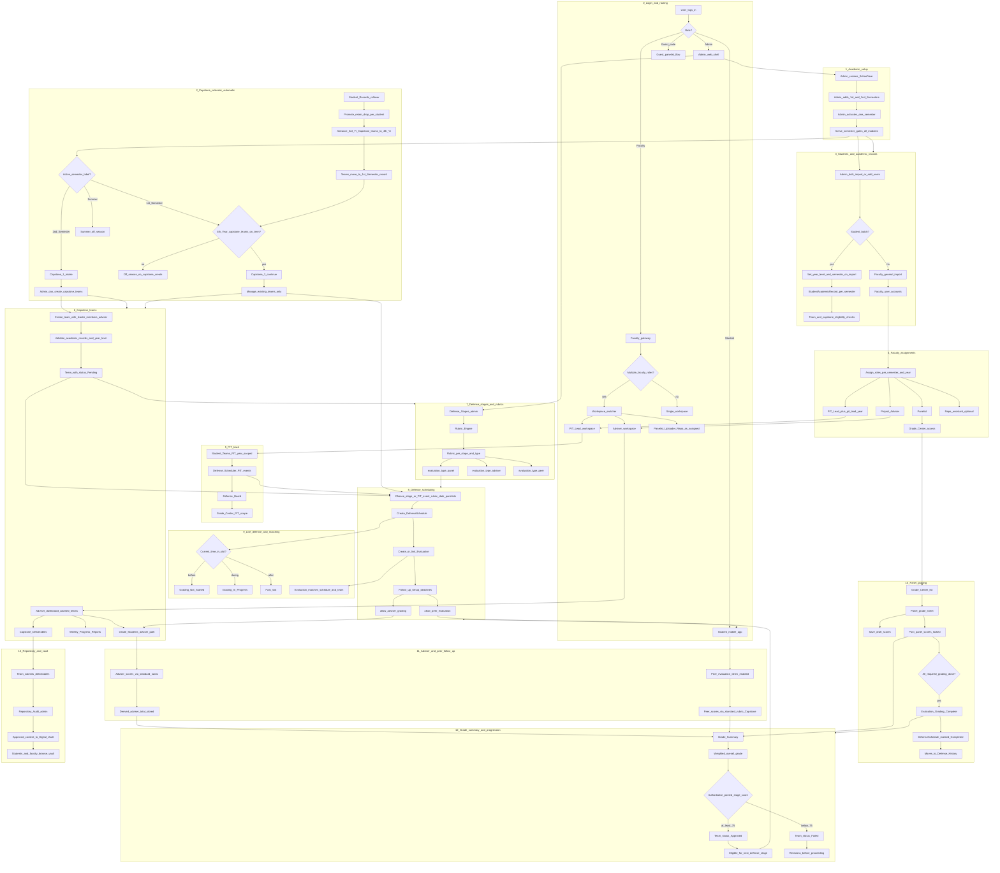

# DefenSYS system flow (single chart)

Visual map of the full DefenSYS workflow. For step-by-step prose, see [DEFENSYS_FLOW_OVERVIEW.md](DEFENSYS_FLOW_OVERVIEW.md). For API and screen details, see [DEFENSYS_REAL_SYSTEM_FLOW.md](DEFENSYS_REAL_SYSTEM_FLOW.md).

**How to read this chart:** Follow top to bottom. Diamonds are automatic decisions. Capstone team creation and phase are derived from the active semester (no manual Capstone phase control in Academic Periods).

## Legend

| Symbol | Meaning |
|--------|---------|
| Rectangle | Action or system state |
| Diamond | Automatic branch |
| Subgraph | Major module or phase of the system |

## Capstone vs PIT (quick reference)

| Calendar | PIT | Capstone |
|----------|-----|----------|
| 1st-2nd Year, both sems | PIT Lead manages PIT teams | Off-season for capstone admin |
| 3rd Year, 1st Sem | PIT (3rd Year) | Off-season; no new capstone teams |
| 3rd Year, 2nd Sem | PIT continues | **Capstone 1** — create teams, schedule, grade |
| 4th Year, 1st Sem | — | **Capstone 2** — same teams after rollover; no new intake |
| 4th Year, 2nd Sem+ | — | Continue or extended teams via rollover rules |

## Faculty workspaces (current UI)

| Workspace | Home focus | Typical nav |
|-----------|------------|-------------|
| PIT Lead | Year-scoped metrics and PIT teams | Teams, Scheduling, Grade Center, Rubrics |
| Adviser | Advised capstone teams | Deliverables, Weekly Reports, Grade Students |
| Panelist | Grade Center and assigned defenses | Via Grade Center / mobile panelist |

Workspaces are **not merged** on one dashboard; faculty with multiple roles use the workspace switcher.

## Status concepts (do not confuse)

| Concept | Used for | Examples |
|---------|----------|----------|
| Grading status | Evaluation workflow | Not Started, In Progress, Grading Complete |
| Team status | Stage progression gate | Pending, Approved, Failed |
| Schedule status | Defense event | Scheduled, Completed, Cancelled |

## Related implementation

- Capstone phase derivation: `backend/modules/academic_period_management/capstone_mode.py`
- Rollover team bump: `backend/modules/user_management/academic_records/views.py`
- Faculty workspaces: `frontend/lib/screens/web/faculty/faculty_dashboard.dart`
