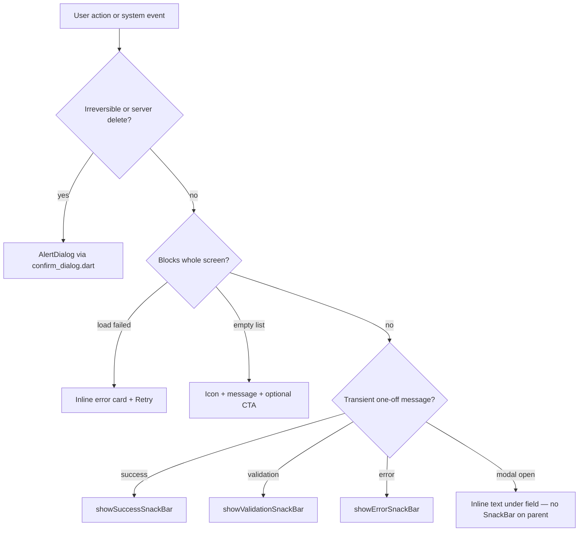

# DefenSYS Frontend UX Guide

Canonical feedback patterns and design tokens for the Flutter app (`frontend/lib/`). Implements [Phase 3](FRONTEND_UX_PHASES.md) through [Phase 6](FRONTEND_UX_PHASES.md) of the UI/UX rollout.

---

## Quick decision: which pattern?



---

## The six patterns

| Situation | Pattern | Implementation |
|-----------|---------|----------------|
| Irreversible / server delete | `AlertDialog` confirm | `confirmDestructive()` or `showConfirmDialog()` in [`confirm_dialog.dart`](../frontend/lib/widgets/confirm_dialog.dart) |
| Logout | Confirm dialog | `confirmLogout()` |
| Validation error (pre-submit) | Inline under field via `TextFormField` validator **or** orange SnackBar for non-form flows | Prefer inline for login/profile; `showValidationSnackBar()` elsewhere |
| Transient success | Green SnackBar (3s) **or** inline banner | `showSuccessSnackBar()` or page `state.message` banner |
| Page load failure | Inline error + Retry | [`ErrorBanner`](../frontend/lib/widgets/error_banner.dart) — not SnackBar-only |
| Empty list | Icon + message + optional action | [`EmptyState`](../frontend/lib/widgets/empty_state.dart) — not an error state |

---

## SnackBar helpers

Use [`feedback_snackbar.dart`](../frontend/lib/widgets/feedback_snackbar.dart) instead of raw `ScaffoldMessenger.showSnackBar` with inline colors.

| Function | Color | Duration | When |
|----------|-------|----------|------|
| `showSuccessSnackBar(context, message)` | `DefensysTokens.success` | 3s | Submit OK, upload OK, post grades OK |
| `showErrorSnackBar(context, message)` | `DefensysTokens.danger` | 4s | Network/server failure |
| `showValidationSnackBar(context, message)` | `DefensysTokens.warning` | 3s | Missing fields, unrated criteria before submit |

```dart
import '../widgets/feedback_snackbar.dart';

// Success
showSuccessSnackBar(context, 'Weekly report submitted successfully!');

// Validation
showValidationSnackBar(context, 'Please enter week number');

// Error
showErrorSnackBar(context, 'Error: $e');
```

**Do not use SnackBar helpers when:**
- A modal dialog is open — show inline error in the dialog (guest code entry).
- The failure blocks the page — use [`ErrorBanner`](../frontend/lib/widgets/error_banner.dart) + Retry.

---

## Design tokens

Single source: [`defensys_tokens.dart`](../frontend/lib/theme/defensys_tokens.dart)

| Token | Value | Use |
|-------|-------|-----|
| `DefensysTokens.maroon` | `#7A110A` | Primary brand, app bars, buttons |
| `DefensysTokens.gold` | `#D97706` | Accent, active nav highlights |
| `DefensysTokens.fontFamily` | `Poppins` | All platforms (bundled in pubspec) |
| Semantic | `success`, `danger`, `warning` | SnackBars, badges, banners |

**Which import?**

| Context | Prefer |
|---------|--------|
| Mobile screens | `Theme.of(context).colorScheme.primary` or `DefensysTokens.maroon` |
| Web admin (legacy) | `DefensysUi.primaryMaroon` — delegates to tokens |
| New code | `DefensysTokens` directly |

**Shared layout widgets:**

| Widget | File | When |
|--------|------|------|
| `EmptyState` | [`empty_state.dart`](../frontend/lib/widgets/empty_state.dart) | Empty lists / no selection |
| `ErrorBanner` | [`error_banner.dart`](../frontend/lib/widgets/error_banner.dart) | Page load failure + Retry |
| `StatusBadge` | [`status_badge.dart`](../frontend/lib/widgets/status_badge.dart) | Table status pills (`DefensysStatusBadge` alias) |

**Do not:** declare local `_primaryColor` / hardcode `#7F1D1D`, `#8F130D`, or `#FFC107`. Use tokens.

[`AppColors`](../frontend/lib/theme/app_theme.dart) remains as backward-compatible aliases to `DefensysTokens`.

---

## Confirm dialogs

| Helper | Use for |
|--------|---------|
| `confirmLogout(context)` | Sign out from any dashboard |
| `confirmDestructive(context, title:, message:, confirmLabel:)` | Delete, replace file, submit-with-lock, post grades |
| `showConfirmDialog(context, ...)` | Non-destructive confirms |

**References:** [`weekly_report_tab.dart`](../frontend/lib/screens/app/student/weekly_report_tab.dart), [`capstone_deliverables_screen.dart`](../frontend/lib/screens/web/shared/capstone_deliverables_screen.dart), [`grade_center_shared.dart`](../frontend/lib/screens/web/admin/grade_center_shared.dart)

---

## Context rule

Never call `ScaffoldMessenger.of(context)` on the **parent** screen `context` while a dialog is open. The SnackBar renders behind the modal.

**Correct:** Inline `Text` or banner inside the dialog’s `StatefulBuilder`, cleared when the user edits the field.

---

## Form validation (Phase 6)

Use `Form` + `GlobalKey<FormState>` + `TextFormField` with `validator` on auth and profile surfaces.

| Surface | File | Rules |
|---------|------|-------|
| Login (web + mobile) | [`login_screen.dart`](../frontend/lib/screens/login_screen.dart) | Required ID/username and password; inline field errors |
| Guest code dialog | [`login_screen.dart`](../frontend/lib/screens/login_screen.dart) | Required code; server invalid/expired → inline `errorText` in dialog |
| Profile edit | [`profile_edit_screen.dart`](../frontend/lib/screens/app/student/profile_edit_screen.dart) | Required name, email format, student ID |

```dart
final _formKey = GlobalKey<FormState>();

void _submit() {
  if (!_formKey.currentState!.validate()) return;
  // API / auth errors only → showErrorSnackBar
}
```

**SnackBar vs inline:**

| Error type | Pattern |
|------------|---------|
| Empty field, bad email format | Inline via `validator` |
| Auth failure, network error | `showErrorSnackBar` |
| Invalid guest code (server) | Inline in dialog (`errorText`), not SnackBar on parent |

**Accessibility:** icon-only `IconButton`s need `tooltip`. Bottom nav labels use 12px+. Dense mobile layouts use `MediaQuery.withClampedTextScaling(maxScaleFactor: 1.3)`.

**Responsive web:** admin and faculty shells use a drawer below `DefensysTokens.minDesktopWidth` (1180px) instead of horizontal scroll.

---

## Reference screens (golden examples)

| Pattern | Example |
|---------|---------|
| Confirm delete | [`team_detail_page.dart`](../frontend/lib/screens/web/admin/team_detail_page.dart) |
| Publish grades confirm | [`grade_center_shared.dart`](../frontend/lib/screens/web/admin/grade_center_shared.dart) |
| Post grades confirm | [`grade_sheet_tab.dart`](../frontend/lib/screens/app/panelist/grade_sheet_tab.dart) |
| Empty state | [`repository_tab.dart`](../frontend/lib/screens/app/student/repository_tab.dart) via `EmptyState` |
| Inline load error + Retry | [`repository_tab.dart`](../frontend/lib/screens/app/student/repository_tab.dart) via `ErrorBanner` |
| Success banner (persistent) | [`uploader_dashboard.dart`](../frontend/lib/screens/web/uploader/uploader_dashboard.dart) |

---

## Anti-patterns (avoid)

| Anti-pattern | Fix |
|--------------|-----|
| SnackBar behind open dialog | Inline error in dialog (guest login) |
| Red SnackBar for success | `showSuccessSnackBar` |
| SnackBar-only for page load failure | Inline card + Retry button |
| Duplicate custom `AlertDialog` for destructive actions | `confirmDestructive` |
| Default grey SnackBar for errors/success | Use helpers |

---

## Migration debt (non-priority screens)

These files may still use raw `SnackBar` until touched in a later pass:

- [`repository_audit_screen.dart`](../frontend/lib/screens/web/shared/repository_audit_screen.dart)
- [`weekly_progress_reports_screen.dart`](../frontend/lib/screens/web/faculty/weekly_progress_reports_screen.dart) — file/action SnackBars only; page errors use inline Retry
- Other admin screens with incidental SnackBars

When editing any screen, migrate its SnackBars to the helpers in the same PR.

---

## Localization (Phase 7)

- Generated strings: [`app_localizations.dart`](../frontend/lib/l10n/app_localizations.dart) from [`app_en.arb`](../frontend/lib/l10n/app_en.arb) / [`app_fil.arb`](../frontend/lib/l10n/app_fil.arb)
- Access: `import '../l10n/l10n_ext.dart';` then `context.l10n.someKey`
- After adding keys: `flutter gen-l10n` from `frontend/`
- HTTP error helpers: `friendlyHttpErrorMessageFromContext(context, status, body)` in [`authz_errors.dart`](../frontend/lib/services/authz_errors.dart)
- Web routes: [`app_router.dart`](../frontend/lib/navigation/app_router.dart) + [`admin_route_paths.dart`](../frontend/lib/navigation/admin_route_paths.dart); use `context.go` / `context.push` / `context.pop` for admin detail views
- **Dark mode:** not in scope — light theme only

---

## Related docs

- [FRONTEND_UX_PHASES.md](FRONTEND_UX_PHASES.md) — phased rollout checklist
- [SYSTEM_OVERVIEW.md](SYSTEM_OVERVIEW.md) — roles and platforms
