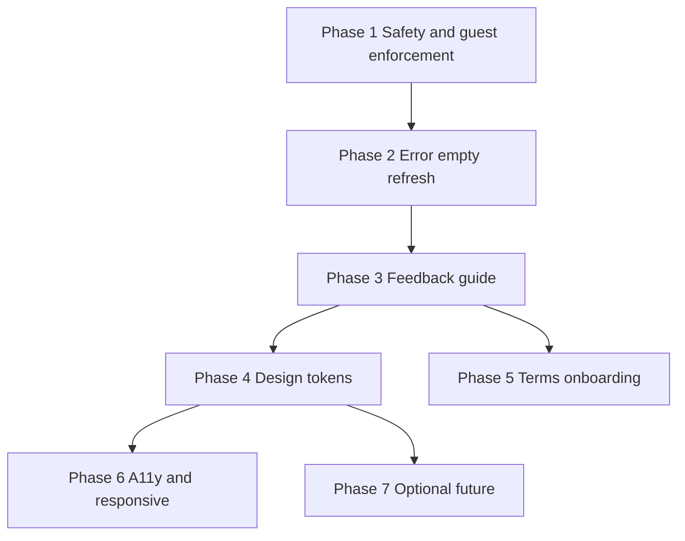

# DefenSYS Frontend UI/UX — Implementation Phases

Actionable rollout for the Flutter frontend UI/UX audit. Full audit context lives in the Cursor plan **Frontend UI UX Audit**; this document is the **phase checklist** for implementation and tracking.

**Scope:** `frontend/lib/` (~50 screens, 96 Dart files)

---

## Platform model (canonical)

| Role | Platform | Credentials |
|------|----------|-------------|
| Student | Mobile only | ID + password |
| Admin / faculty (adviser, PIT, uploader) | Web only | Username/email + password |
| Faculty panelist (defense) | Mobile only | ID + password (`is_panelist`) |
| Guest panelist | Mobile only | Access code only (`DEF-XXXXXX`) |

Guest panelists use a **code-only panel** on mobile login — not username/password. They share [`PanelistDashboard`](../frontend/lib/screens/app/panelist_dashboard.dart) with faculty panelists but use `guest_panelist` role and guest API paths.

---

## Phase 1 — Safety, confirmations, guest enforcement

**Effort:** 1–2 days  
**Priority:** Highest — prevents accidental data loss and wrong-platform access

### Checklist

- [ ] Add shared [`frontend/lib/widgets/confirm_dialog.dart`](../frontend/lib/widgets/confirm_dialog.dart) with `confirmLogout`, `confirmDestructive`, etc.
- [ ] **Logout confirmation** (5 entry points):
  - [ ] [`student_dashboard.dart`](../frontend/lib/screens/app/student_dashboard.dart)
  - [ ] [`panelist_dashboard.dart`](../frontend/lib/screens/app/panelist_dashboard.dart)
  - [ ] [`admin_shell.dart`](../frontend/lib/screens/web/admin/admin_shell.dart)
  - [ ] [`faculty_dashboard.dart`](../frontend/lib/screens/web/faculty/faculty_dashboard.dart)
  - [ ] [`uploader_dashboard.dart`](../frontend/lib/screens/web/uploader/uploader_dashboard.dart)
- [ ] **Remove deliverable file** — confirm before `_removeFile()` in [`capstone_deliverables_screen.dart`](../frontend/lib/screens/web/shared/capstone_deliverables_screen.dart)
- [ ] **Replace deliverable** — confirm when `uploaded == true` before upload dialog (same file)
- [ ] **Weekly report submit** — confirm week + filename in [`weekly_report_tab.dart`](../frontend/lib/screens/app/student/weekly_report_tab.dart) (match [`peer_eval_tab.dart`](../frontend/lib/screens/app/student/peer_eval_tab.dart))
- [ ] **Discard bulk import draft** — confirm in [`student_teams_screen.dart`](../frontend/lib/screens/web/admin/student_teams_screen.dart) `_discardBulkDraft`

### Guest mobile-only enforcement

- [ ] Remove `guest_panelist` from [`webDashboardForUser`](../frontend/lib/navigation/app_home.dart) (no web dashboard for guests)
- [ ] Block `loginGuest` / `_showGuestDialog` when `kIsWeb` (including narrow browser viewports)
- [ ] Route successful guest login through [`TermsAgreementScreen`](../frontend/lib/screens/terms_agreement_screen.dart) → `PanelistDashboard` (not direct skip)

---

## Phase 2 — Errors, loading, empty states, refresh

**Effort:** 1–2 days  
**Depends on:** Phase 1 (optional; can run in parallel)

### Checklist

| Screen | Task |
|--------|------|
| [`repository_tab.dart`](../frontend/lib/screens/app/student/repository_tab.dart) | Show `digitalVaultProvider` error + Retry |
| [`assignments_tab.dart`](../frontend/lib/screens/app/panelist/assignments_tab.dart) | Empty state when `teams.isEmpty` |
| [`panelist_dashboard.dart`](../frontend/lib/screens/app/panelist_dashboard.dart) | Persistent error card + Retry (not SnackBar-only) |
| [`grade_center_team_detail_screen.dart`](../frontend/lib/screens/web/admin/grade_center_team_detail_screen.dart) | Display `state.error` + Retry |
| [`admin_dashboard_content.dart`](../frontend/lib/screens/web/admin/admin_dashboard_content.dart) | Spinner instead of text-only “Loading…” |

### Pull-to-refresh

Add `RefreshIndicator` where lists are data-driven:

- [ ] Mobile: repository, weekly report, team tabs
- [ ] Web: [`weekly_progress_reports_screen.dart`](../frontend/lib/screens/web/faculty/weekly_progress_reports_screen.dart)

### Optional

- [ ] Session expired: persistent banner on [`login_screen.dart`](../frontend/lib/screens/login_screen.dart) (in addition to SnackBar)

---

## Phase 3 — Feedback patterns and UX guide

**Effort:** ~1 day  
**Depends on:** Phase 1 (`confirm_dialog.dart` foundation)

### Standard patterns (document in `docs/FRONTEND_UX_GUIDE.md`)

| Situation | Pattern |
|-----------|---------|
| Irreversible / server delete | `AlertDialog` confirm |
| Logout | Confirm dialog |
| Validation error | Inline field error **or** SnackBar (one per form) |
| Transient success | Green SnackBar (2–3s) or inline banner |
| Page load failure | Inline error + Retry |
| Empty list | Icon + message + optional primary action |

### Checklist

- [x] Create [`docs/FRONTEND_UX_GUIDE.md`](FRONTEND_UX_GUIDE.md) with rules above
- [x] Add [`frontend/lib/widgets/feedback_snackbar.dart`](../frontend/lib/widgets/feedback_snackbar.dart) — `showSuccessSnackBar`, `showErrorSnackBar`, `showValidationSnackBar`
- [x] Migrate priority screens to helpers (weekly report, peer eval, grade sheet, capstone deliverables, login API errors)
- [x] Guest login: show invalid-code error **inside** dialog, not SnackBar behind dialog ([`login_screen.dart`](../frontend/lib/screens/login_screen.dart))
- [x] Faculty weekly progress: inline load error + Retry ([`weekly_progress_reports_screen.dart`](../frontend/lib/screens/web/faculty/weekly_progress_reports_screen.dart))
- [x] `confirmDestructive` on peer eval submit and grade sheet post
- [x] Audit highest-traffic screens for SnackBar color consistency

---

## Phase 4 — Design system consolidation

**Effort:** 2–3 days  
**Depends on:** Phase 3 (shared widgets)

### Known problem (today)

The frontend runs **two parallel design systems**:

| Layer | File | Font | Maroon | Gold |
|-------|------|------|--------|------|
| Mobile + global theme | [`app_theme.dart`](../frontend/lib/theme/app_theme.dart) | `Inter` (not bundled — falls back to system font) | `#7F1D1D` | `#D97706` |
| Web admin shell | [`defensys_admin_shell.dart`](../frontend/lib/screens/web/admin/widgets/defensys_admin_shell.dart) (`DefensysUi`) | `Poppins` (bundled) | `#7A110A` | `#FFC107` |
| Login screen | [`login_screen.dart`](../frontend/lib/screens/login_screen.dart) | inherits theme | `#8F130D` (hardcoded) | — |

Additional drift:

- **17+ screen files** declare local `_primaryColor` / `_maroon` / `_goldColor` instead of importing shared colors.
- Phase 3 widgets ([`confirm_dialog.dart`](../frontend/lib/widgets/confirm_dialog.dart), [`feedback_snackbar.dart`](../frontend/lib/widgets/feedback_snackbar.dart)) partially use `AppColors` but SnackBar success/error still use raw `Colors.green` / `Colors.red`.
- UI patterns are duplicated: empty states (5+ bespoke `_buildEmptyState` methods), error + Retry (inline in grade center and panelist dashboard), status badge (`DefensysStatusBadge` embedded in admin shell).

### Decisions (confirmed)

| Token | Value | Notes |
|-------|-------|-------|
| Maroon | `#7A110A` | Align mobile, login, launcher, and admin to admin-shell brand red |
| Font | **Poppins** everywhere | Already bundled in [`pubspec.yaml`](../frontend/pubspec.yaml); remove ineffective `Inter` references |
| Gold | `#D97706` | Replace `#FFC107` faculty/admin highlights; `goldLight` (`#F59E0B`) overlaps with warning |
| Dark mode | Deferred | Not in scope unless explicitly requested |

### Target architecture

**New file:** [`frontend/lib/theme/defensys_tokens.dart`](../frontend/lib/theme/defensys_tokens.dart) — single source for colors, spacing, radius, and Poppins text styles.

**Refactor chain (backward compatible):**

- [`app_theme.dart`](../frontend/lib/theme/app_theme.dart): `AppColors` delegates to tokens; global `fontFamily: 'Poppins'`; `ColorScheme.primary` → `#7A110A`.
- [`defensys_admin_shell.dart`](../frontend/lib/screens/web/admin/widgets/defensys_admin_shell.dart): `DefensysUi` color/text constants delegate to tokens; keep `DefensysUi` name as compatibility façade through Phase 6.
- Phase 3 widgets import token semantic colors (`success`, `danger`, `warning`).

**Platform assets:** update launcher/android maroon to `#7A110A` in [`pubspec.yaml`](../frontend/pubspec.yaml) and [`colors.xml`](../frontend/android/app/src/main/res/values/colors.xml).

**Shared widgets** (move to `lib/widgets/`):

| Widget | Source | API |
|--------|--------|-----|
| [`empty_state.dart`](../frontend/lib/widgets/empty_state.dart) | [`weekly_progress_reports_screen.dart`](../frontend/lib/screens/web/faculty/weekly_progress_reports_screen.dart) | `EmptyState(icon:, message:, actionLabel:, onAction:)` |
| [`error_banner.dart`](../frontend/lib/widgets/error_banner.dart) | [`grade_center_team_detail_screen.dart`](../frontend/lib/screens/web/admin/grade_center_team_detail_screen.dart) | `ErrorBanner(title:, message:, onRetry:)` |
| [`status_badge.dart`](../frontend/lib/widgets/status_badge.dart) | `DefensysStatusBadge` in admin shell | `StatusBadge` + `DefensysStatusBadge` typedef alias |

### Migration tiers

**Tier A — Foundation (~0.5 day)**

- [x] Create [`defensys_tokens.dart`](../frontend/lib/theme/defensys_tokens.dart)
- [x] Wire [`app_theme.dart`](../frontend/lib/theme/app_theme.dart) + `DefensysUi` to tokens
- [x] Update [`feedback_snackbar.dart`](../frontend/lib/widgets/feedback_snackbar.dart) and [`confirm_dialog.dart`](../frontend/lib/widgets/confirm_dialog.dart) to token colors
- [x] Update launcher/android maroon to `#7A110A`

**Tier B — Shared widgets (~0.5 day)**

- [x] Extract `EmptyState`, `ErrorBanner`, `StatusBadge` to `lib/widgets/`
- [x] Migrate Phase 2 priority screens:
  - [x] [`repository_tab.dart`](../frontend/lib/screens/app/student/repository_tab.dart) (error + empty)
  - [x] [`panelist_dashboard.dart`](../frontend/lib/screens/app/panelist_dashboard.dart) (error)
  - [x] [`grade_center_team_detail_screen.dart`](../frontend/lib/screens/web/admin/grade_center_team_detail_screen.dart) (error)
  - [x] [`weekly_progress_reports_screen.dart`](../frontend/lib/screens/web/faculty/weekly_progress_reports_screen.dart) (empty)

**Tier C — Top-traffic color migration (~1 day)**

Remove local `_primaryColor` / hardcoded maroon from:

- [x] Mobile shells: [`student_dashboard.dart`](../frontend/lib/screens/app/student_dashboard.dart), [`panelist_dashboard.dart`](../frontend/lib/screens/app/panelist_dashboard.dart)
- [x] Mobile tabs: repository, weekly report, peer eval, grade sheet, team, assignments, my grades, overall results, profile edit
- [x] Entry: [`login_screen.dart`](../frontend/lib/screens/login_screen.dart) (`#8F130D` → token maroon)
- [x] Web shells: [`faculty_dashboard.dart`](../frontend/lib/screens/web/faculty/faculty_dashboard.dart) (`#FFC107` → token gold), [`uploader_dashboard.dart`](../frontend/lib/screens/web/uploader/uploader_dashboard.dart)

**Tier D — Opportunistic (backlog, not blocking Phase 6)**

- Remaining admin screens with inline colors migrate when touched
- Replace duplicated `_buildEmptyState` private methods as screens are edited

### Acceptance criteria

- Grep shows **zero** `#7F1D1D`, `#8F130D`, `#FFC107` in `frontend/lib/` (except comments)
- Grep shows **zero** `fontFamily: 'Inter'` in theme
- All Phase 2 error/empty screens use shared widgets
- Visual spot-check: login, student mobile nav, admin sidebar, faculty dashboard — maroon/gold consistent
- `flutter analyze` clean on touched files

### Out of scope

- Dark mode
- Full admin screen migration (Tier D backlog)
- Localization of hardcoded strings (Phase 7)

---

## Phase 5 — Terms and onboarding

**Effort:** ~1 day  
**Depends on:** Product decision for web staff  
**User-reported issue:** Terms screen appears on **every** mobile login — included in this phase.

### Resolved (Phase 5 complete)

Mobile login uses [`TermsAcceptance`](../frontend/lib/services/terms_acceptance.dart) (`SharedPreferences` key `defensys_terms_accepted_version`) and [`TermsConstants.currentVersion`](../frontend/lib/services/terms_constants.dart). [`post_auth_navigation.dart`](../frontend/lib/navigation/post_auth_navigation.dart) skips [`TermsAgreementScreen`](../frontend/lib/screens/terms_agreement_screen.dart) when the stored version matches. Acceptance survives logout (per device). Web staff remain on no gate; guest panelists use per-device persistence.

### Target behavior

| When | Show full terms gate? |
|------|------------------------|
| First login on device (or after terms version bump) | Yes |
| Subsequent logins (same device, same terms version) | No — go straight to dashboard |
| User opens Terms from profile / About | Yes — read-only, no gate |
| Terms document updated by institution | Yes — once per new version |

### Checklist

- [x] **Fix repeat terms on mobile (priority):**
  - [x] Add `termsAcceptedVersion` via [`AuthStorageKeys.termsAcceptedVersion`](../frontend/lib/services/auth_storage_keys.dart) + `SharedPreferences` (not auth session blobs)
  - [x] Define `TermsConstants.currentVersion` (`'2025-05'`) in [`terms_constants.dart`](../frontend/lib/services/terms_constants.dart); bump when legal copy changes
  - [x] On “Agree & Continue”, persist current version ([`terms_agreement_screen.dart`](../frontend/lib/screens/terms_agreement_screen.dart))
  - [x] [`navigateToHomeAfterAuth`](../frontend/lib/navigation/post_auth_navigation.dart) used from `_navigateAfterAuth` and session restore ([`login_screen.dart`](../frontend/lib/screens/login_screen.dart))
  - [x] Guest panelist: same skip logic after code verify
- [x] **Guest panelist:** Per-device acceptance (survives logout; not per code session)
- [x] **Web admin/faculty:** Keep web skip (no terms gate)
- [x] Do **not** add guest code entry on web (unchanged)

### Version bump (operational)

When legal copy changes: update terms text, increment `TermsConstants.currentVersion`, ship app update.

### Deferred UX (optional)

- Guest entry: full-screen code panel vs dialog on login

---

## Phase 6 — Forms, accessibility, responsive shells

**Effort:** 2–4 days  
**Depends on:** Phase 4 (theme tokens)

### Forms

- [x] Login, profile, guest code: `TextFormField` + `validator` where appropriate
- [x] Profile: email format validation
- [x] SnackBar only for submit-level / network errors

### Accessibility

- [x] `tooltip` on icon-only `IconButton`s (P0–P1 high-traffic screens)
- [x] Bump nav labels from 11px → 12px in [`app_theme.dart`](../frontend/lib/theme/app_theme.dart)
- [x] Contrast check: documented in [`defensys_tokens.dart`](../frontend/lib/theme/defensys_tokens.dart)
- [x] `MediaQuery.withClampedTextScaling` on login + mobile dashboards

### Responsive web

- [x] [`defensys_admin_shell.dart`](../frontend/lib/screens/web/admin/widgets/defensys_admin_shell.dart): drawer below 1180px (replaces horizontal scroll)
- [x] [`faculty_dashboard.dart`](../frontend/lib/screens/web/faculty/faculty_dashboard.dart): same drawer pattern as admin

---

## Phase 7 — Optional / future backlog

Implemented on request. **Dark mode is out of scope** (light theme only).

### 7A — Repository search debounce

- [x] 350ms debounce on student vault search in [`repository_tab.dart`](../frontend/lib/screens/app/student/repository_tab.dart)
- [x] Removed unused client-side `_mlSearch()` block

### 7B — Unsaved changes (`PopScope`)

- [x] [`unsaved_changes.dart`](../frontend/lib/utils/unsaved_changes.dart) + confirm on discard
- [x] Rubric editor, defense stage editor, bulk import review (PopScope + back guards)

### 7C — go_router (web navigation)

- [x] `go_router` + [`app_router.dart`](../frontend/lib/navigation/app_router.dart) + [`admin_route_paths.dart`](../frontend/lib/navigation/admin_route_paths.dart)
- [x] Admin section URLs + detail routes (teams, grades, rubrics, stages, bulk import)
- [x] Faculty section URLs + team detail; browser Back via `context.pop()`
- [x] Mobile routes: `/login`, `/terms`, `/student`, `/panelist`

### 7D — Offline banner

- [x] `connectivity_plus` + [`connectivity_provider.dart`](../frontend/lib/services/connectivity_provider.dart)
- [x] [`offline_banner.dart`](../frontend/lib/widgets/offline_banner.dart) in admin shell, faculty dashboard, student/panelist dashboards

### 7E — Localization bootstrap

- [x] `l10n.yaml`, [`app_en.arb`](../frontend/lib/l10n/app_en.arb), [`app_fil.arb`](../frontend/lib/l10n/app_fil.arb), `flutter gen-l10n`
- [x] [`l10n_ext.dart`](../frontend/lib/l10n/l10n_ext.dart) (`context.l10n`)
- [x] Tier 1: login (partial), shared widgets, admin nav, mobile nav, authz fallbacks

### 7F — Undo after delete (pilot)

- [x] `showUndoSnackBar` in [`feedback_snackbar.dart`](../frontend/lib/widgets/feedback_snackbar.dart)
- [x] Delayed delete pilot on capstone deliverable file remove (5s undo window)
- Team/rubric delete undo deferred until backend soft-delete

### 7H — Full localization (ongoing opportunistic)

- [x] Second locale file (`app_fil.arb`) + infrastructure
- [ ] Remaining admin screen copy migrates when touched — use `context.l10n` / add keys to `.arb`

### Out of scope

- **Dark mode** — not planned
- Backend API message localization

---

## Reference templates (copy existing patterns)

| Pattern | Example file |
|---------|----------------|
| Confirm delete | [`team_detail_page.dart`](../frontend/lib/screens/web/admin/team_detail_page.dart) |
| Publish grades confirm | [`grade_center_shared.dart`](../frontend/lib/screens/web/admin/grade_center_shared.dart) |
| Post grades confirm | [`grade_sheet_tab.dart`](../frontend/lib/screens/app/panelist/grade_sheet_tab.dart) |
| Empty state | [`repository_audit_screen.dart`](../frontend/lib/screens/web/shared/repository_audit_screen.dart) |
| Success banner | [`uploader_dashboard.dart`](../frontend/lib/screens/web/uploader/uploader_dashboard.dart) |

---

## Tracking

| Phase | Status | Owner | Notes |
|-------|--------|-------|-------|
| 1 | Not started | | |
| 2 | Not started | | |
| 3 | Complete | | UX guide, feedback_snackbar, guest dialog, priority migrations |
| 4 | Complete | | Tokens, shared widgets, Tier A–C migration |
| 5 | Complete | | Terms persistence, post_auth_navigation, web skip |
| 6 | Complete | | Forms, a11y tooltips/nav labels, responsive drawer shells |
| 7 | Complete | | 7A–7F done; 7H opportunistic for remaining screens |

Update this table as phases complete.

---

## Related docs

- [SYSTEM_OVERVIEW.md](SYSTEM_OVERVIEW.md) — system roles and flows
- [DEFENSYS_REAL_SYSTEM_FLOW.md](DEFENSYS_REAL_SYSTEM_FLOW.md) — end-to-end behavior
- [FRONTEND_UX_GUIDE.md](FRONTEND_UX_GUIDE.md) — feedback patterns and SnackBar helpers
