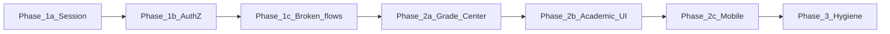

# DefenSYS — Phased Implementation Roadmap

Actionable plan derived from the [system audit](../.cursor/plans/defensys_system_audit_02ef93c6.plan.md) (May 2026). Work **one phase at a time**; do not start the next phase until acceptance criteria for the current phase pass.

**Stack:** Django REST + SimpleJWT (`backend/`), Flutter web + mobile (`frontend/`).

---

## Overview

| Phase | Focus | Est. effort |
|-------|--------|-------------|
| **1a** | JWT session policy + expert hardening (refresh/blacklist, proactive refresh, Remember me, redirect on expiry) | 7–8 days |
| **1b** | Authorization hardening (API permissions, panelist auth, default perms, logging) | 4–6 days |
| **1c** | Broken production flows (guest panelist, media URLs, mobile routing) | 3–5 days |
| **2a** | Grade Center data & access fixes | 2–4 days |
| **2b** | Academic period / capstone admin UI | 2–3 days |
| **2c** | Panelist & mobile polish | 2–4 days |
| **3** | Docs, dead code, tests, maintainability | Ongoing |

---

## Phase 1a — JWT session policy

### Goals

1. **Web (admin/faculty):** Closing the browser/tab ends the session; user must sign in again.
2. **Active use:** Session does **not** expire while the user is working (refresh extends access).
3. **Expired session:** **Redirect to login** (clear navigation stack) with: *“Your session ended. Please sign in again.”* — no raw HTTP/JWT errors in SnackBars **and no full-screen error on the page they were on** (e.g. Grade Center must not show `HTTP 401` or `No authentication token found`).

### Session rules (product)

| Rule | Implementation |
|------|----------------|
| Ends on browser close | Store **refresh token** in **sessionStorage** on web (not localStorage / SharedPreferences for auth) |
| Stays valid while active | Central HTTP client refreshes access on 401 and optionally on a debounced activity timer |
| Friendly expiry | Global handler → `logout()` → `pushAndRemoveUntil` → `LoginScreen` + SnackBar; providers must not set `state.error` for auth failures |

**Mobile (students/panelists):** Keep persistent login on device (SharedPreferences / secure storage) unless product later requires app-kill logout.

### Backend tasks

- [ ] Update `SIMPLE_JWT` in [`backend/defensys_backend/settings.py`](../backend/defensys_backend/settings.py):
  - Access: **45 minutes**; refresh: **10 hours** (absolute work-day cap, not idle-based).
  - `ROTATE_REFRESH_TOKENS: True` + `BLACKLIST_AFTER_ROTATION: True` with **`rest_framework_simplejwt.token_blacklist`** (migrate DB).
- [ ] `POST /api/auth/logout/` — blacklist refresh token on logout.
- [ ] `GET /api/auth/me/` — current user profile (same shape as login `user`); call after refresh on client.
- [ ] Rate-limit `POST /api/auth/token/refresh/` (DRF throttle).
- [ ] Confirm login: `POST /api/auth/login/` → `access`, `refresh`, `user`.
- [ ] Tests: refresh rotation, reuse old refresh → 401, logout blacklists, `/me/` auth.

### Frontend tasks

- [ ] Add [`session_storage.dart`](../frontend/lib/services/session_storage.dart): web `sessionStorage` / `localStorage` (Remember me); mobile **`flutter_secure_storage`** for refresh.
- [ ] Refactor [`auth_provider.dart`](../frontend/lib/services/auth_provider.dart):
  - Access in memory only; refresh in session storage (web) or secure storage (mobile).
  - **`isRestoring` gate** — splash until refresh + `GET /me/` complete; block API until ready.
  - Server logout (`POST /auth/logout/`) then clear all stores; legacy `jwt_token` cleanup.
  - **Multi-tab sync** (Remember me): `BroadcastChannel` or `storage` event when refresh rotates.
- [ ] Add `authenticated_client.dart` (or extend [`api_http.dart`](../frontend/lib/services/api_http.dart)):
  - Attach `Authorization: Bearer <access>`.
  - On **401**: refresh once → retry; if refresh fails → signal session expired.
  - **Proactive refresh (required):** refresh access ~90s before JWT `exp` (decode client-side) — **not** logging in again. Debounced refresh on API activity when access is past half lifetime.
  - After refresh: persist new refresh, `GET /me/`, broadcast to other tabs.
  - Remove debug logs of token length/material ([`repository_tab.dart`](../frontend/lib/screens/app/student/repository_tab.dart), etc.).
- [ ] Add root `NavigatorKey` + `sessionExpiredProvider` (or auth flag) wired from HTTP layer to [`main.dart`](../frontend/lib/main.dart):
  - On unrecoverable auth failure: `logout()` + `pushAndRemoveUntil` → [`LoginScreen`](../frontend/lib/screens/login_screen.dart) (clears admin shell / nested routes).
  - SnackBar on login only — **do not** leave user on dashboard with `state.error` text.
  - Introduce `SessionExpiredException`; providers catch it without rendering inline errors.
  - Remove provider paths that set `error: 'No authentication token found.'` or throw for missing token (let authenticated client redirect).
- [ ] Migrate providers from `prefs.getString('jwt_token')` to authenticated client (batch by module or all at once).
- [ ] **Remember me** (required): wire checkbox on [`login_screen.dart`](../frontend/lib/screens/login_screen.dart) — pass `rememberMe` into `authProvider.login()`:
  - **Unchecked (web default):** refresh + user in `sessionStorage` → session ends on browser/tab close.
  - **Checked (web):** refresh + user in `localStorage` → stay signed in across browser restarts until refresh expires or logout.
  - Persist choice in `remember_me` pref; on login clear the other web store to avoid duplicates.
  - **Mobile:** secure storage; checkbox optional/hidden on non-web.
  - Helper text: *“Only enable on personal devices.”*
- [ ] Migrate **all** auth bypass paths (providers + [`repository_tab.dart`](../frontend/lib/screens/app/student/repository_tab.dart), multipart, PDF headers) to authenticated client.

### Files (primary)

| Layer | Files |
|-------|--------|
| Backend | `settings.py`, `authentication_access_control/views.py`, `urls.py` (logout, me, blacklist) |
| Frontend | `auth_provider.dart`, `authenticated_client.dart`, `session_storage.dart`, `main.dart`, `login_screen.dart`, `pubspec.yaml` (`flutter_secure_storage`) |
| Tests | `frontend/test/providers/auth_provider_test.dart`, new `authenticated_client_test.dart` |

### Acceptance criteria

- [ ] Open admin app → login **without** Remember me → close **all** browser windows → reopen → **login screen** (not dashboard).
- [ ] Login **with** Remember me → close all windows → reopen → **dashboard** (session restored) until refresh expires or logout.
- [ ] Stay logged in and use Grade Center / Teams for 30+ minutes without forced logout.
- [ ] Manually delete access / wait for expiry with refresh still present → next action succeeds without user noticing OR single transparent refresh.
- [ ] Invalidate refresh (devtools) → next API call → **redirect to login screen** + friendly SnackBar (previous screen must not show “HTTP 401”, “No authentication token found”, or other auth error UI).
- [ ] Mobile student login still works across app restarts (secure storage).
- [ ] Logout invalidates refresh server-side; proactive refresh prevents mid-form 401 over 45+ min.
- [ ] Two Remember me tabs: rotation in one tab does not break the other.

### Manual test script

1. Web login as admin → verify network tab shows Bearer on API calls.
2. Close tab → reopen URL → must login.
3. Login → leave tab open 45 min with occasional clicks → still authenticated.
4. DevTools → delete refresh → click nav → redirect login + message (no error on Grade Center).
5. Remember me on → close browser → reopen → dashboard.
6. Two tabs → refresh in one → other tab still works.
7. Logout → reuse old refresh in DevTools → 401.

**Deferred (post-1a):** httpOnly cookie refresh, idle timeout, `token_version`, CSP hardening.

**Detail:** [Phase 1a elaboration plan](../.cursor/plans/phase_1a_session_elaboration_5c44083c.plan.md).

---

## Phase 1b — Authorization hardening

### Goals

Only the right roles can mutate sensitive data; dashboards are not readable cross-role.

**Multi-hat faculty:** Admins may still assign multiple capability flags on one faculty user (`is_panelist`, `is_pit_lead`, `is_adviser`, etc.). “Cross-role” means calling an endpoint **without** the required role or flag (e.g. student → admin dashboard), not limiting faculty to a single hat.

### Backend tasks

- [ ] **Academic periods:** Add `IsSystemAdmin` to POST school year, POST semester, PATCH active semester in [`academic_period_management/views.py`](../backend/modules/academic_period_management/views.py).
- [ ] **Dashboards:** Add role checks per endpoint in [`dashboards/views.py`](../backend/modules/dashboards/views.py) (admin / faculty / student / panelist).
- [ ] **Faculty dashboard payload:** Review `GET /dashboards/faculty/` — confirm no cross-adviser leak; scope or gate if needed.
- [ ] **Team documents:** Enforce `user_can_access_team_document` on POST in [`student_teams/documents/views.py`](../backend/modules/student_teams/documents/views.py).
- [ ] **Panelist scheduler APIs:** Require JWT on [`PanelistAssignmentsView`](../backend/modules/defense/scheduler/views.py) and grade submit — identity from `request.user`; verify `PanelAssignment` for submit; remove anonymous `panelist_id` for production.
- [ ] **Default permissions:** Set `DEFAULT_PERMISSION_CLASSES = [IsAuthenticated]` in [`settings.py`](../backend/defensys_backend/settings.py); audit explicit `AllowAny` on login, refresh, health.
- [ ] **403 logging:** Log permission denials server-side (user id, path, method); generic `detail` to clients.
- [ ] **Tests:** student cannot PATCH active semester; student cannot GET admin dashboard; non-member cannot upload team document; panelist cannot submit for unassigned team; multi-hat faculty gets 200 on faculty + panelist dashboards and 403 on admin.

### Frontend tasks

- [ ] Panelist flows: send JWT on assignment + submit via authenticated client after 1b backend is ready (guest token remains Phase 1c).
- [ ] Handle 403 with user-friendly “You don’t have permission” (not stack traces).

### Acceptance criteria

- [ ] Non-admin JWT receives **403** on academic period writes.
- [ ] Cross-role dashboard access returns **403**; multi-hat faculty with flags can access each matching dashboard.
- [ ] Panelist endpoints reject unauthenticated callers; submit rejects unassigned team (guest-token path deferred to 1c).
- [ ] `DEFAULT_PERMISSION_CLASSES` active; public endpoints explicitly `AllowAny`.
- [ ] Faculty dashboard payload reviewed (documented or fixed).
- [ ] 403 denials logged server-side.

**Detail:** [Phase 1b elaboration plan](../.cursor/plans/phase_1b_authz_elaboration_571e1494.plan.md).

---

## Phase 1c — Broken production flows

### Tasks

- [ ] **Guest panelist:** Fix ID mapping in [`login_screen.dart`](../frontend/lib/screens/login_screen.dart) — guest code must resolve to real `panelist_id` or use dedicated guest JWT from backend.
- [ ] **Media URLs:** Central helper `ApiConfig.authenticatedMediaUrl(path)` → `/api/media/files/...`; replace hardcoded `/media/` in [`team_detail_page.dart`](../frontend/lib/screens/web/admin/team_detail_page.dart), [`repository_tab.dart`](../frontend/lib/screens/app/student/repository_tab.dart), weekly reports.
- [ ] **Mobile faculty routing:** Block or redirect advisers/PIT leads on mobile in [`login_screen.dart`](../frontend/lib/screens/login_screen.dart) with clear copy (“Use the web app for faculty tools”).
- [ ] **PIT lead Grade Center:** Default scope to `pit` when user is PIT lead ([`grade_center_screen.dart`](../frontend/lib/screens/web/admin/grade_center_screen.dart)).

### Acceptance criteria

- [ ] Guest panelist can load assignments and submit grades (or flow hidden until fixed).
- [ ] Protected PDFs open for authorized users via media API.
- [ ] Faculty adviser on mobile sees block message, not PanelistDashboard.

**Detail:** [Phase 1c elaboration plan](../.cursor/plans/phase_1c_elaboration_8d903191.plan.md).

---

## Phase 2a — Grade Center fixes

### Tasks

- [ ] Backend: extend [`build_group_settings_map`](../backend/modules/grading/grades/services.py) to include **all active capstone stages** (or add `capstone_stages[]` to grade list payload).
- [ ] Backend or frontend: read-only defense stages for `CanManageGradeCenter` (embed in grades API or new GET).
- [ ] Frontend: KPI cards use `counts['filtered']` when filters active ([`grade_center_screen.dart`](../frontend/lib/screens/web/admin/grade_center_screen.dart)).
- [ ] Frontend: banner or row for **Unscheduled** grades.
- [ ] Frontend: horizontal scroll on Capstone table ([`grade_center_capstone_table.dart`](../frontend/lib/screens/web/admin/grade_center_capstone_table.dart)); search debounce + sync with `state.search`.
- [ ] Slim [`grade_center_event_teams_screen.dart`](../frontend/lib/screens/web/admin/grade_center_event_teams_screen.dart) — remove duplicate term toggles if table is canonical.

### Acceptance criteria

- [ ] Stage marked officially complete with **0 teams** persists after full page reload.
- [ ] PIT lead sees PIT events, not empty Capstone table.
- [ ] [`grade_center_capstone_rows_test.dart`](../frontend/test/grade_center_capstone_rows_test.dart) still passes; add backend test for full stage settings map.

**Detail:** [Phase 2a elaboration plan](../.cursor/plans/phase_2a_elaboration_e43ddfe0.plan.md).

---

## Phase 2b — Academic period / capstone admin UI

**Product model (agreed):** Calendar-driven capstone intake — activating **2nd Semester** derives `capstone_1` + team creation (no manual phase override in v1). **Term-wide** peer/adviser toggles move from Grade Center → Academic Periods. **PIT** peer grading stays **per event** in Grade Center (`peer_grading_enabled` on group settings); not on this screen.

**UI reference:** Phase 2b mockup (`phase_2b_academic_periods_final.png` in project assets).

### Goals

1. Admins see **why** Student Teams allows or blocks create/import (capstone phase + mode message).
2. One place for **term policy**: active semester, capstone window, peer eval, adviser grading.
3. Grade Center Capstone tab is **grading only** (stages, filters, table) — no cluttered `TERM SETTINGS` inset.

### Backend tasks

- [ ] **GET** [`/api/academic-periods/`](../backend/modules/academic_period_management/views.py): include `capstone_mode`, `can_create_capstone_teams`, `capstone_mode_message` on `active_semester` (reuse `capstone_mode_payload()` from [`capstone_mode.py`](../backend/modules/academic_period_management/capstone_mode.py)).
- [ ] **PATCH** [`/api/academic-periods/semesters/<id>/`](../backend/modules/academic_period_management/views.py):
  - Keep `is_active` + auto-derive `capstone_program_phase` / `capstone_team_creation_enabled` via `normalize_capstone_flags()` (read-only in UI).
  - Add writable **`capstone_peer_evaluation_enabled`** and **`capstone_adviser_grading_enabled`** on request body (admin only, `IsSystemAdmin`).
- [ ] Deprecate or keep as alias: `PATCH /api/grading/grades/evaluation-settings/` — may delegate to same semester fields or remain for backward compatibility; frontend uses semester PATCH only after 2b.
- [ ] Tests in [`academic_period_management/tests.py`](../backend/modules/academic_period_management/tests.py): PATCH peer/adviser flags; GET active semester includes capstone_mode; activate 2nd sem → capstone_1 + team creation (existing capstone tests still pass).

### Frontend tasks — Academic Periods

- [ ] Add **Capstone program** card on [`academic_periods_screen.dart`](../frontend/lib/screens/web/admin/academic_periods_screen.dart) when `active_semester` is set:
  - Read-only **Program phase** badge (`none` / Capstone 1 intake / Capstone 2 continue) from `capstone_program_phase` + helper: *Auto-derived when 2nd Semester is active.*
  - Read-only **Allow new capstone teams** (from `capstone_team_creation_enabled` or `can_create_capstone_teams`).
  - Writable toggles: **Peer evaluation**, **Adviser grading** → PATCH semester via provider.
  - Info line: *PIT peer grading is configured per event in Grade Center.*
- [ ] Semesters table: add **Capstone** column (chips: Closed / Capstone 1 / Capstone 2 / —).
- [ ] Update page subtitle + active banner subtext to mention capstone intake when `capstone_mode == capstone_1_intake`.
- [ ] [`academic_period_provider.dart`](../frontend/lib/services/academic_period_provider.dart): `updateSemesterEvaluationSettings(...)`, parse capstone fields from GET; after save/refetch, invalidate or refetch [`student_teams_provider.dart`](../frontend/lib/services/student_teams_provider.dart) so Teams reflects mode immediately.

### Frontend tasks — Grade Center cleanup

- [ ] Remove `_termSettingsInset` from [`grade_center_capstone_table.dart`](../frontend/lib/screens/web/admin/grade_center_capstone_table.dart) (fixes cramped layout with filters).
- [ ] Optional: read-only chips in Capstone card header via [`grade_center_shared.dart`](../frontend/lib/screens/web/admin/grade_center_shared.dart) — “Peer eval: ON · Adviser: ON” with link text *Change in Academic Periods*.
- [ ] Remove `updateCapstoneEvaluationSettings` usage from [`grade_center_screen.dart`](../frontend/lib/screens/web/admin/grade_center_screen.dart) if unused; keep **per-stage** `peer_grading_enabled` on Capstone stage rows and **all PIT event** peer toggles unchanged.

### Files (primary)

| Layer | Files |
|-------|--------|
| Backend | `academic_period_management/views.py`, `capstone_mode.py`, `serializers.py`, `tests.py`, `tests_capstone_mode.py` |
| Frontend | `academic_periods_screen.dart`, `academic_period_provider.dart`, `grade_center_capstone_table.dart`, `grade_center_screen.dart` |
| Reference | `student_teams_screen.dart` (consumer of `capstone_mode`; optional banner follow-up) |

### Acceptance criteria

- [ ] Active **2nd Semester** → Academic Periods shows **Capstone 1 intake**, team creation allowed, peer/adviser toggles work.
- [ ] Student Teams: Create / Bulk Import enabled when `capstone_mode == capstone_1_intake` without manual DB edit.
- [ ] Toggle peer OFF on Academic Periods → student Peer Eval tab blocked; toggle adviser OFF → adviser submit blocked.
- [ ] Grade Center Capstone tab has **no** duplicate peer/adviser toggles; PIT scope still has per-event peer only.
- [ ] Activate **1st Semester** (with rollover teams) → phase shows Capstone 2 / creation closed; Teams shows continuation message.

**Detail:** [Phase 2b elaboration plan](../.cursor/plans/phase_2b_academic_ui_c05dd6a8.plan.md).

---

## Phase 2c — Panelist & mobile polish

### Tasks

- [ ] Implement panelist **Results** tab API + UI OR hide tab until ready ([`panelist_dashboard.dart`](../frontend/lib/screens/app/panelist_dashboard.dart)).
- [ ] **Multi-panelist score averaging** — implement TODO in [`defense/scheduler/views.py`](../backend/modules/defense/scheduler/views.py) line ~435.
- [ ] Consolidate student vault: pick `RepositoryTab` **or** `DigitalVaultScreen`; one HTTP stack.
- [ ] Peer eval: remove 80% prefill default or require explicit edit ([`peer_eval_tab.dart`](../frontend/lib/screens/app/student/peer_eval_tab.dart)).

### Acceptance criteria

- [ ] Panelist sees completed grades in Results OR tab is absent.
- [ ] Two panelists scoring same team produces averaged panel score (document formula in tests).

---

## Phase 3 — Hygiene & documentation

### Tasks

- [x] Update [`DEFENSYS_REAL_SYSTEM_FLOW.md`](DEFENSYS_REAL_SYSTEM_FLOW.md): current API paths, peer eval exists, session policy section.
- [x] Mark [`FEATURE_AUDIT.md`](FEATURE_AUDIT.md) as **prototype-only** at top or archive.
- [x] Sync [`openapi.yaml`](openapi.yaml): remove `/repository/audit/classify/` or implement it; add group-settings, peer-evaluations, media files, pit-lead routes.
- [x] Remove or wire orphan screens: `adviser_criteria_screen.dart`, `leaderboard_tab.dart`, `dev_panelist_dashboard.dart`.
- [x] Replace hardcoded IPs in [`api_config.dart`](../frontend/lib/config/api_config.dart) with `--dart-define=DEFENSYS_API_HOST`.
- [x] Remove debug `print` in providers; replace swallowed `catch (_) {}` with logged errors where appropriate.
- [x] Security regression tests for all Phase 1 items.
- [x] Remove prototype-only docs, redundant installers (`install_pdf_*`, `requirements_ml.txt`), duplicate venv script, and obsolete `backend/scripts/` + `backend/tests/` one-offs.

---

## Out of scope (track separately)

- Per-stage verdict model
- Responsive/mobile Grade Center table redesign
- Leaderboard / awarding (currently mock)
- Full faculty mobile app
- OpenAPI classify endpoint (spec-only unless product requests)

---

## Progress tracker

Copy into PR descriptions or mark here as you ship:

| Phase | Status | PR / notes |
|-------|--------|------------|
| 1a Session | ☐ Not started | |
| 1b AuthZ | ☐ Not started | |
| 1c Broken flows | ☐ Not started | |
| 2a Grade Center | ☐ Not started | Option B UI shipped; data fixes remain |
| 2b Academic UI | ☑ Shipped | Capstone card on Academic Periods; peer/adviser moved from Grade Center |
| 2c Panelist/mobile | ☐ Not started | |
| 3 Hygiene | ☑ Shipped | Docs, OpenAPI, orphans, setup cleanup, security regression |

---

## Related documents

- [DEFENSYS_REAL_SYSTEM_FLOW.md](DEFENSYS_REAL_SYSTEM_FLOW.md) — flows (needs update after Phase 3)
- [AGENTS.md](AGENTS.md) — DB safety for tests
- [Grade Center Option B plan](../.cursor/plans/grade_center_option_b_84769c21.plan.md) — UI redesign (implemented)
- [System audit plan](../.cursor/plans/defensys_system_audit_02ef93c6.plan.md) — full findings
