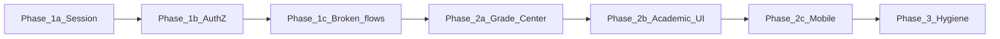

# DefenSYS — Phased Implementation Roadmap

Actionable plan derived from the [system audit](../.cursor/plans/defensys_system_audit_02ef93c6.plan.md) (May 2026). Work **one phase at a time**; do not start the next phase until acceptance criteria for the current phase pass.

**Stack:** Django REST + SimpleJWT (`backend/`), Flutter web + mobile (`frontend/`).

---

## Overview

| Phase | Focus | Est. effort |
|-------|--------|-------------|
| **1a** | JWT session policy (browser-close logout, active-use refresh, friendly expiry) | 3–5 days |
| **1b** | Authorization hardening (API permissions, panelist auth) | 3–5 days |
| **1c** | Broken production flows (guest panelist, media URLs, mobile routing) | 3–5 days |
| **2a** | Grade Center data & access fixes | 2–4 days |
| **2b** | Academic period / capstone admin UI | 2–3 days |
| **2c** | Panelist & mobile polish | 2–4 days |
| **3** | Docs, dead code, tests, maintainability | Ongoing |

---

## Phase 1a — JWT session policy

### Goals

1. **Web (admin/faculty):** Closing the browser/tab ends the session; user must sign in again.
2. **Active use:** Session does **not** expire while the user is working (refresh extends access).
3. **Expired session:** Redirect to login with: *“Your session ended. Please sign in again.”* — no raw HTTP/JWT errors in SnackBars.

### Session rules (product)

| Rule | Implementation |
|------|----------------|
| Ends on browser close | Store **refresh token** in **sessionStorage** on web (not localStorage / SharedPreferences for auth) |
| Stays valid while active | Central HTTP client refreshes access on 401 and optionally on a debounced activity timer |
| Friendly expiry | Global handler → `logout()` → `LoginScreen` + message |

**Mobile (students/panelists):** Keep persistent login on device (SharedPreferences / secure storage) unless product later requires app-kill logout.

### Backend tasks

- [ ] Update `SIMPLE_JWT` in [`backend/defensys_backend/settings.py`](../backend/defensys_backend/settings.py):
  - Access lifetime: **30–60 minutes** (idle cap if refresh fails).
  - Refresh lifetime: **8–12 hours** (covers a work day in one tab).
  - Consider `ROTATE_REFRESH_TOKENS: True` when storing refresh client-side.
- [ ] Confirm login returns both tokens: `POST /api/auth/login/` → `access`, `refresh` ([`authentication_access_control`](../backend/modules/authentication_access_control/)).
- [ ] Confirm refresh endpoint: `POST /api/auth/token/refresh/`.
- [ ] Add backend tests: expired access + valid refresh → new access; invalid refresh → 401.

### Frontend tasks

- [ ] Add `frontend/lib/services/session_storage.dart` (web: `sessionStorage`; mobile: no-op or secure storage).
- [ ] Refactor [`auth_provider.dart`](../frontend/lib/services/auth_provider.dart):
  - Store **refresh** (+ user snapshot) in session storage on **web**.
  - Keep **access** in memory (`AuthState`) only.
  - On app start (web): if refresh exists → call refresh → restore user; else stay logged out.
  - Stop persisting access in SharedPreferences on web.
  - Clear legacy `jwt_token` from localStorage on first load after deploy.
- [ ] Add `authenticated_client.dart` (or extend [`api_http.dart`](../frontend/lib/services/api_http.dart)):
  - Attach `Authorization: Bearer <access>`.
  - On **401**: refresh once → retry; if refresh fails → signal session expired.
  - Optional: debounced proactive refresh every 10–15 min after successful calls.
- [ ] Add `sessionExpiredProvider` or callback wired from HTTP layer to [`main.dart`](../frontend/lib/main.dart):
  - `logout()` + navigate to [`LoginScreen`](../frontend/lib/screens/login_screen.dart).
  - Pass message query param or Riverpod flag for SnackBar on login.
- [ ] Migrate providers from `prefs.getString('jwt_token')` to authenticated client (batch by module or all at once).
- [ ] **Remember me** (optional): wire checkbox on [`login_screen.dart`](../frontend/lib/screens/login_screen.dart) — if checked, use localStorage + longer refresh; if unchecked, sessionStorage only. Or remove checkbox until implemented.

### Files (primary)

| Layer | Files |
|-------|--------|
| Backend | `defensys_backend/settings.py`, `authentication_access_control/urls.py` |
| Frontend | `auth_provider.dart`, `api_http.dart`, `session_storage.dart`, `main.dart`, `login_screen.dart` |
| Tests | `frontend/test/providers/auth_provider_test.dart`, new `authenticated_client_test.dart` |

### Acceptance criteria

- [ ] Open admin app → login → close **all** browser windows → reopen → **login screen** (not dashboard).
- [ ] Stay logged in and use Grade Center / Teams for 30+ minutes without forced logout.
- [ ] Manually delete access / wait for expiry with refresh still present → next action succeeds without user noticing OR single transparent refresh.
- [ ] Invalidate refresh (devtools) → next API call → login screen + friendly message (no “HTTP 401” / “Connection error” for auth).
- [ ] Mobile student login still works across app restarts.

### Manual test script

1. Web login as admin → verify network tab shows Bearer on API calls.
2. Close tab → reopen URL → must login.
3. Login → leave tab open 45 min with occasional clicks → still authenticated.
4. DevTools → Application → sessionStorage → delete refresh → click any nav item → redirect login + message.

---

## Phase 1b — Authorization hardening

### Goals

Only the right roles can mutate sensitive data; dashboards are not readable cross-role.

### Backend tasks

- [ ] **Academic periods:** Add `IsSystemAdmin` to POST school year, POST semester, PATCH active semester in [`academic_period_management/views.py`](../backend/modules/academic_period_management/views.py).
- [ ] **Dashboards:** Add role checks per endpoint in [`dashboards/views.py`](../backend/modules/dashboards/views.py) (admin / faculty / student / panelist).
- [ ] **Team documents:** Enforce `user_can_access_team_document` on POST in [`student_teams/documents/views.py`](../backend/modules/student_teams/documents/views.py).
- [ ] **Panelist scheduler APIs:** Require JWT (or signed guest token) on [`PanelistAssignmentsView`](../backend/modules/defense/scheduler/views.py) and grade submit — remove anonymous `panelist_id` query param for production.
- [ ] Tests: student cannot PATCH active semester; student cannot GET admin dashboard; non-member cannot upload team document.

### Frontend tasks

- [ ] Panelist / guest flows: send JWT on assignment + submit calls after 1b backend is ready.
- [ ] Handle 403 with user-friendly “You don’t have permission” (not stack traces).

### Acceptance criteria

- [ ] Non-admin JWT receives **403** on academic period writes.
- [ ] Cross-role dashboard access returns **403**.
- [ ] Panelist endpoints reject unauthenticated callers (except explicit guest-token path if added in 1c).

---

## Phase 1c — Broken production flows

### Tasks

- [ ] **Guest panelist:** Fix ID mapping in [`login_screen.dart`](../frontend/lib/screens/login_screen.dart) — guest code must resolve to real `panelist_id` or use dedicated guest JWT from backend.
- [ ] **Media URLs:** Central helper `ApiConfig.authenticatedMediaUrl(path)` → `/api/media/files/...`; replace hardcoded `/media/` in [`team_detail_page.dart`](../frontend/lib/screens/web/admin/team_detail_page.dart), [`repository_tab.dart`](../frontend/lib/screens/app/student/repository_tab.dart), weekly reports.
- [ ] **Mobile faculty routing:** Block or redirect advisers/PIT leads on mobile in [`login_screen.dart`](../frontend/lib/screens/login_screen.dart) with clear copy (“Use the web app for faculty tools”).
- [ ] **PIT lead Grade Center:** Default scope to `pit` when user is PIT lead ([`grade_center_screen.dart`](../frontend/lib/screens/web/admin/grade_center_screen.dart)).

### Acceptance criteria

- [ ] Guest panelist can load assignments and submit grades (or flow hidden until fixed).
- [ ] Protected PDFs open for authorized users via media API.
- [ ] Faculty adviser on mobile sees block message, not PanelistDashboard.

---

## Phase 2a — Grade Center fixes

### Tasks

- [ ] Backend: extend [`build_group_settings_map`](../backend/modules/grading/grades/services.py) to include **all active capstone stages** (or add `capstone_stages[]` to grade list payload).
- [ ] Backend or frontend: read-only defense stages for `CanManageGradeCenter` (embed in grades API or new GET).
- [ ] Frontend: KPI cards use `counts['filtered']` when filters active ([`grade_center_screen.dart`](../frontend/lib/screens/web/admin/grade_center_screen.dart)).
- [ ] Frontend: banner or row for **Unscheduled** grades.
- [ ] Frontend: horizontal scroll on Capstone table ([`grade_center_capstone_table.dart`](../frontend/lib/screens/web/admin/grade_center_capstone_table.dart)); search debounce + sync with `state.search`.
- [ ] Slim [`grade_center_event_teams_screen.dart`](../frontend/lib/screens/web/admin/grade_center_event_teams_screen.dart) — remove duplicate term toggles if table is canonical.

### Acceptance criteria

- [ ] Stage marked officially complete with **0 teams** persists after full page reload.
- [ ] PIT lead sees PIT events, not empty Capstone table.
- [ ] [`grade_center_capstone_rows_test.dart`](../frontend/test/grade_center_capstone_rows_test.dart) still passes; add backend test for full stage settings map.

---

## Phase 2b — Academic period / capstone admin UI

### Tasks

- [ ] Expose on active semester in [`academic_periods_screen.dart`](../frontend/lib/screens/web/admin/academic_periods_screen.dart):
  - `capstone_program_phase` (none / capstone_1 / capstone_2)
  - `capstone_team_creation_enabled`
  - (Optional) move peer/adviser flags here from Grade Center term inset for single admin location
- [ ] Wire PATCH to semester API ([`academic_period_provider.dart`](../frontend/lib/services/academic_period_provider.dart)).
- [ ] Backend: ensure serializer exposes writable fields ([`academic_period_management/serializers.py`](../backend/modules/academic_period_management/serializers.py)).

### Acceptance criteria

- [ ] Admin sets Capstone 1 intake → Student Teams screen reflects `capstone_mode` without DB manual edit.

---

## Phase 2c — Panelist & mobile polish

### Tasks

- [ ] Implement panelist **Results** tab API + UI OR hide tab until ready ([`panelist_dashboard.dart`](../frontend/lib/screens/app/panelist_dashboard.dart)).
- [ ] **Multi-panelist score averaging** — implement TODO in [`defense/scheduler/views.py`](../backend/modules/defense/scheduler/views.py) line ~435.
- [ ] Consolidate student vault: pick `RepositoryTab` **or** `DigitalVaultScreen`; one HTTP stack.
- [ ] Peer eval: remove 80% prefill default or require explicit edit ([`peer_eval_tab.dart`](../frontend/lib/screens/app/student/peer_eval_tab.dart)).

### Acceptance criteria

- [ ] Panelist sees completed grades in Results OR tab is absent.
- [ ] Two panelists scoring same team produces averaged panel score (document formula in tests).

---

## Phase 3 — Hygiene & documentation

### Tasks

- [ ] Update [`DEFENSYS_REAL_SYSTEM_FLOW.md`](DEFENSYS_REAL_SYSTEM_FLOW.md): current API paths, peer eval exists, session policy section.
- [ ] Mark [`FEATURE_AUDIT.md`](FEATURE_AUDIT.md) as **prototype-only** at top or archive.
- [ ] Sync [`openapi.yaml`](openapi.yaml): remove `/repository/audit/classify/` or implement it; add group-settings, peer-evaluations, media files, pit-lead routes.
- [ ] Remove or wire orphan screens: `adviser_criteria_screen.dart`, `leaderboard_tab.dart`, `dev_panelist_dashboard.dart`.
- [ ] Replace hardcoded IPs in [`api_config.dart`](../frontend/lib/config/api_config.dart) with `--dart-define=DEFENSYS_API_HOST`.
- [ ] Remove debug `print` in providers; replace swallowed `catch (_) {}` with logged errors where appropriate.
- [ ] Security regression tests for all Phase 1 items.

---

## Out of scope (track separately)

- Per-stage verdict model
- Responsive/mobile Grade Center table redesign
- Leaderboard / awarding (currently mock)
- Full faculty mobile app
- OpenAPI classify endpoint (spec-only unless product requests)

---

## Progress tracker

Copy into PR descriptions or mark here as you ship:

| Phase | Status | PR / notes |
|-------|--------|------------|
| 1a Session | ☐ Not started | |
| 1b AuthZ | ☐ Not started | |
| 1c Broken flows | ☐ Not started | |
| 2a Grade Center | ☐ Not started | Option B UI shipped; data fixes remain |
| 2b Academic UI | ☐ Not started | |
| 2c Panelist/mobile | ☐ Not started | |
| 3 Hygiene | ☐ Not started | |

---

## Related documents

- [DEFENSYS_REAL_SYSTEM_FLOW.md](DEFENSYS_REAL_SYSTEM_FLOW.md) — flows (needs update after Phase 3)
- [AGENTS.md](AGENTS.md) — DB safety for tests
- [Grade Center Option B plan](../.cursor/plans/grade_center_option_b_84769c21.plan.md) — UI redesign (implemented)
- [System audit plan](../.cursor/plans/defensys_system_audit_02ef93c6.plan.md) — full findings
