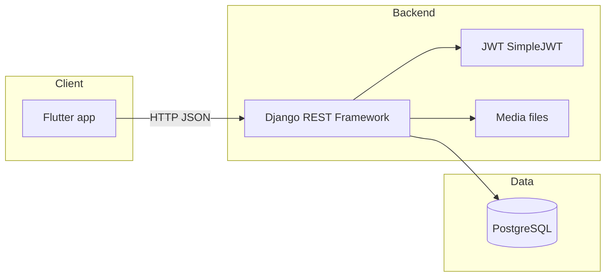

# DefenSYS — System Overview

DefenSYS is a capstone / defense management platform: Django REST API backend, Flutter client (mobile + web-capable), JWT authentication, and PostgreSQL (configured in settings). It covers teams, defense stages, scheduling, rubrics, grading, deliverables, a digital vault, weekly progress, and admin workflows.

---

## Architecture

- **API prefix:** `/api/` (see `backend/defensys_backend/urls.py`).
- **Auth:** `POST /api/login/`, `POST /api/token/refresh/`.
- **Media:** served under `/media/` when `DEBUG` is true.

---

## Backend (`backend/`)

**Layout:** Django **apps** live under **`backend/modules/`** (each subfolder is one `INSTALLED_APPS` entry). **`backend/tests/`** holds ad-hoc scripts (not pytest/Django discovery targets for those files — see `backend/tests/README.md`). **`backend/defensys_backend/`** is the project package (`settings`, `urls`, WSGI). `settings.py` prepends `modules/` to `sys.path` so app import paths stay unchanged (`authentication_access_control`, …).

| App | Responsibility |
|-----|----------------|
| `authentication_access_control` | Custom `User` model, JWT login |
| `dashboards` | Dashboard aggregates |
| `academic_period_management` | School years / semesters |
| `user_management` | Users, guest panelist codes; `academic_records` submodule |
| `student_teams` | Teams, members, advisers; `documents`, `weekly_progress` submodules |
| `defense` | `stages`, `scheduler`, `board` submodules |
| `grading` | `rubrics` and `grades` (grade center, peer eval) |
| `repository` | `vault`, `deliverables`, `audit` submodules |
| `curriculum_analytics` | Curriculum-related analytics |

**Stack notes:** Django 6.x, `rest_framework`, `rest_framework_simplejwt`. Dependencies live in **`backend/requirements.txt`** (includes PDF and ML packages). Use one virtualenv at **`backend/venv/`** (see `setup_venv.ps1` or [DEMO_SETUP_GUIDE.md](DEMO_SETUP_GUIDE.md)).

**Prototype demo-fill APIs** (`demo-fill`, `seed-demo`) were removed for deployment. Use normal admin workflows, imports, and mobile peer evaluation (`POST /api/grading/grades/peer-evaluations/`).

---

## Frontend (`frontend/`)

- **Framework:** Flutter 3.x (`pubspec.yaml`), **state:** Riverpod.
- **HTTP:** `http` package; **storage:** `shared_preferences` for JWT and user payload.
- **Config:** `lib/config/api_config.dart` resolves host/port (`8000`), with `dart-define` overrides for LAN/emulator.
- **Optional bridge:** `lib/services/bridge_service.dart` can call a separate process on port `8080` for role bridging (legacy/demo path); main API is Django.

**UI structure (high level):**

| Area | Role / use |
|------|------------|
| `screens/login_screen.dart` | Entry |
| `screens/app/student_*` | Student dashboard, team, vault, weekly report, peer eval, repository |
| `screens/app/panelist_*` | Panelist grading and assignments |
| `screens/web/admin_*` | Admin shell: users, teams, schedules, rubrics, grade center, periods, etc. |
| `screens/web/faculty_*` | Faculty / adviser flows |
| `screens/web/uploader_*` | Uploader role dashboard |
| `services/*_provider.dart` | One provider per major API domain |

---

## User model & authorization

`authentication_access_control.User` extends Django `AbstractUser` with:

- **role:** `admin` | `faculty` | `student`
- **Faculty flags:** `is_panelist`, `is_pit_lead`, `is_adviser`, `is_documenter`, `is_uploader`, etc.

Custom permission classes (e.g. `IsSystemAdmin`, `CanManageTeams`, `CanManageSchedules`) are used across views; not all list endpoints use the same policy (see audit below).

---

## CORS and transport

`defensys_backend.cors.LocalCorsMiddleware` reflects `Access-Control-Allow-Origin` **only when `DEBUG` is true** and the `Origin` matches localhost, `127.0.0.1`, or private `192.168.*` / `10.*` patterns. There is no `https` origin handling in that helper (relevant if you move to TLS on LAN).

---

## Security & configuration audit

Findings are ordered by severity for production readiness. This is a **point-in-time** review of the repository as audited.

### Critical — treat before any public or shared deployment

1. **Secrets in source control**  
   `SECRET_KEY`, database password, and JWT signing key linkage to `SECRET_KEY` live in `settings.py` as plain values. Anyone with repo access can forge JWTs and connect to the DB if the host is reachable.

2. **`DEBUG = True`**  
   Enables verbose errors and, with current `urls.py`, **serves `/media/`** without the normal production hardening. Must be `False` behind a real web server for production.

3. **Default DRF permission**  
   `REST_FRAMEWORK` does not set `DEFAULT_PERMISSION_CLASSES`. Any view that omits permissions defaults to **AllowAny** unless each view sets permissions explicitly. The codebase mostly sets permissions per view; risk is **future** views forgetting to do so.

### High — data exposure without authentication

4. **Public GET on teams list** *(mitigated in code)*  
   `StudentTeamListCreateView` now requires **`IsAuthenticated`**; team rows are scoped by role (admin / PIT lead / uploader: full roster; faculty: advised teams; student: own team); full student/adviser pick lists are omitted unless the user may manage the team directory.

5. **Public GET on rubrics list** *(mitigated in code)*  
   `RubricListCreateView` **`GET`** now requires **`IsAuthenticated`**; non–rubric-managers only receive **published** rubrics; admins and PIT leads keep full catalog access for management.

6. **Public team documents list** *(mitigated in code)*  
   `TeamDocumentListView` requires **`IsAuthenticated`** and lists only documents for teams the user may access; detail and download enforce the same team boundary.

### Medium — authenticated but broad visibility

7. **Digital Vault**  
   `digital_vault/services.py` documents that **all authenticated users** see the same visible vault corpus (no per-team isolation for the main visible set). Appropriate for a school-wide archive policy or a privacy issue depending on requirements.

8. **JWT lifetimes**  
   Access token lifetime is **45 minutes**, refresh **10 hours** with rotation and blacklist on logout — see `SIMPLE_JWT` in `settings.py`.

9. **Guest panelist code validation**  
   `GuestCodeValidateView` is intentionally public (`permission_classes = []`). It returns defense/team/stage context for a valid code. Ensure rate limiting and code entropy meet your threat model.

### Low / operational

10. **Dependencies**  
    Pin versions in `backend/requirements.txt` (or adopt `pyproject.toml`) for reproducible installs in CI and production.

11. **Repository hygiene**  
    Git status showed many `__pycache__` paths and `db.sqlite3`; confirm `.gitignore` at repo root excludes secrets, bytecode, and local databases for teams that commit to shared remotes.

12. **`BridgeService` (port 8080)**  
    Secondary HTTP bridge for roles; if unused in production, disable or document to avoid split-brain configuration.

---

## Recommendations (summary)

- Move secrets to environment variables or a secret manager; rotate `SECRET_KEY` and DB credentials after any leak.
- Set `DEBUG=False`, configure `ALLOWED_HOSTS` and HTTPS, serve media via signed URLs or authenticated views.
- Teams, rubrics list, and team documents list now use **`IsAuthenticated`** plus role-scoped data; keep tightening object-level rules as requirements evolve.
- Add `DEFAULT_PERMISSION_CLASSES = ('rest_framework.permissions.IsAuthenticated',)` and explicitly mark only login/refresh/guest validation as `AllowAny`.
- Shorten JWT access lifetime; enable refresh rotation/blacklist if using long-lived sessions.
- Publish a single locked dependency file for the backend and run `python manage.py check --deploy` before go-live.

---

## Document history

| Date | Change |
|------|--------|
| 2026-05-13 | Initial system overview and audit snapshot |
