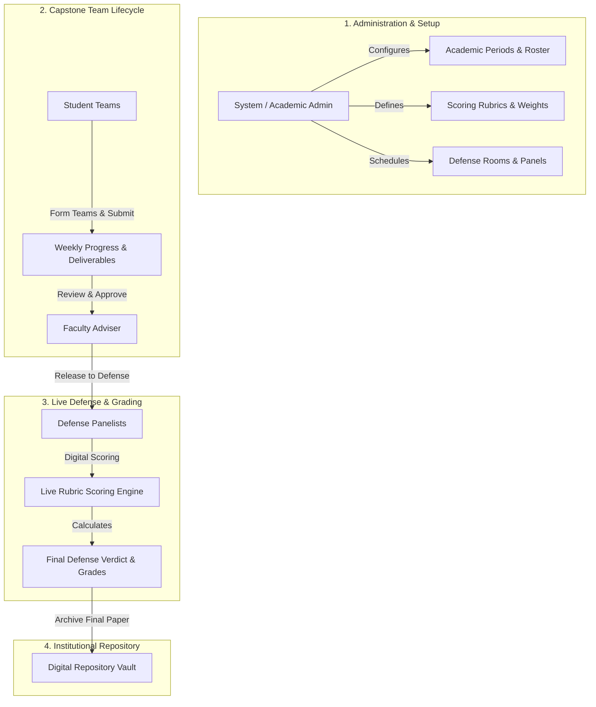

# DefenSYS — System Purpose & Logo Redesign Guide

## 🎓 Executive Summary

**DefenSYS** is an enterprise-grade **Capstone & Defense Management Platform**. It automates and streamlines academic capstone project workflows, thesis defenses, evaluation rubrics, grade calculations, and digital paper archiving.

In traditional academic institutions, managing capstones relies heavily on manual spreadsheets, paper rubric sheets, untracked email attachments, and complex scheduling. **DefenSYS** bridges this gap by unifying students, faculty advisers, defense panelists, and administrators into a synchronized digital ecosystem.

---

## 🏗️ Core System Purpose & Workflows



---

## 👥 Scoped Roles & System Capabilities

### 1. 🎓 Students
* **Team & Roster Management**: Form capstone groups, register team members, and view assigned faculty advisers.
* **Progress Tracking**: Submit weekly progress logs and project status updates.
* **Deliverable Vault**: Upload proposal manuscripts, system source code links, and final thesis documents.
* **Defense Portal**: View scheduled defense dates, room assignments, and panel members.
* **Peer Evaluations**: Complete anonymous peer contribution evaluations for team members.

### 2. 👨‍🏫 Faculty Advisers
* **Team Supervision**: Oversee assigned capstone teams and track project progress across milestones.
* **Deliverable Review & Approval**: Review team submissions and grant clearance for official defense stages (Title Defense, Proposal Defense, Final Defense).
* **Adviser Ratings**: Submit adviser progress ratings and evaluations.

### 3. ⚖️ Defense Panelists & Evaluators
* **Live Digital Scorecards**: Grade student defense presentations in real time on tablets or web browsers.
* **Dynamic Rubric Scoring**: Evaluate teams across weighted criteria (e.g., Technical Complexity, Presentation Skill, Research Methodology).
* **Verdicts & Feedback**: Enter panel comments and render official defense verdicts (*Passed*, *Passed with Revisions*, *Re-defense required*).

### 4. 🛡️ System & Academic Administrators
* **Academic Period Management**: Manage academic years, semesters, and cohort rollovers.
* **Conflict-Free Defense Scheduler**: Allocate defense slots, assign panel members, and manage room schedules.
* **Rubric & Grade Center**: Configure custom scoring criteria, grade composition formulas, and weight distributions.
* **User & Role Administration**: Bulk import student/faculty rosters and assign operational permissions.

### 5. 🗄️ Institutional Repository (Digital Vault)
* **Central Archival**: Securely stores final approved manuscripts, research abstracts, and defense history.
* **Audit Trail**: Maintains immutable defense history records, score logs, and compliance documentation.

---

## 🎨 System Identity & Official Emblem: Concept 02

### Official Brand Direction: "Academic Manuscript Spire Vault"

The official emblem for DefenSYS is **Concept 02 (Academic Manuscript Spire Vault)**, which combines three core identity anchors:
1. **3 Open Book Spreads**: Represent the 3 capstone defense milestones — **Title Defense**, **Proposal Defense**, and **Final Capstone Archival**.
2. **Academic Mortarboard Spire**: The top diamond cap symbolizes academic completion, graduation, and institutional rigor.
3. **Archival Vault Foundation**: The stacked geometric base represents paper archives, rubric score logs, and digital repository vault storage.

```
       ┌──────────────────────────────────────────────┐
       │             DefenSYS Brand Palette           │
       ├──────────────────┬─────────────┬─────────────┤
       │ Color            │ Hex Code    │ Usage       │
       ├──────────────────┼─────────────┼─────────────┤
       │ Academic Maroon  │ #7A110A     │ Primary     │
       │ Approved Gold    │ #F59E0B     │ Accent      │
       │ Pure White       │ #FFFFFF     │ Surface     │
       │ Dark Neutral     │ #111827     │ Typography  │
       └──────────────────┴─────────────┴─────────────┘
```

---

## 🚀 System Integration & Asset Mapping

The official Concept 02 assets are generated and integrated across the Flutter Web & Mobile client:
- **`assets/logo.png`** — 512x512 high-resolution White Concept 02 mark (used for Android launcher icon generation).
- **`assets/logo-login-mark.png`** — Pure White Concept 02 mark for mobile login header.
- **Sized login marks**: `logo-login-mark-48.png`, `logo-login-mark-58.png`, `logo-login-mark-74.png`, `logo-login-mark-116.png`.
- **`assets/logo-web-mark.png`** — Brand Dual-Tone (Academic Maroon & Approved Gold) Concept 02 mark for Web Navigation Shells.

Showcase & Studio References:
- Interactive 10-Ideas Gallery: [`docs/LOGO_CONCEPTS_SHOWCASE_10_IDEAS.html`](file:///c:/Users/Admin/Desktop/DefenSYS/docs/LOGO_CONCEPTS_SHOWCASE_10_IDEAS.html)
- Concept 02 Master Studio: [`docs/CONCEPT_2_MASTER_STUDIO.html`](file:///c:/Users/Admin/Desktop/DefenSYS/docs/CONCEPT_2_MASTER_STUDIO.html)

